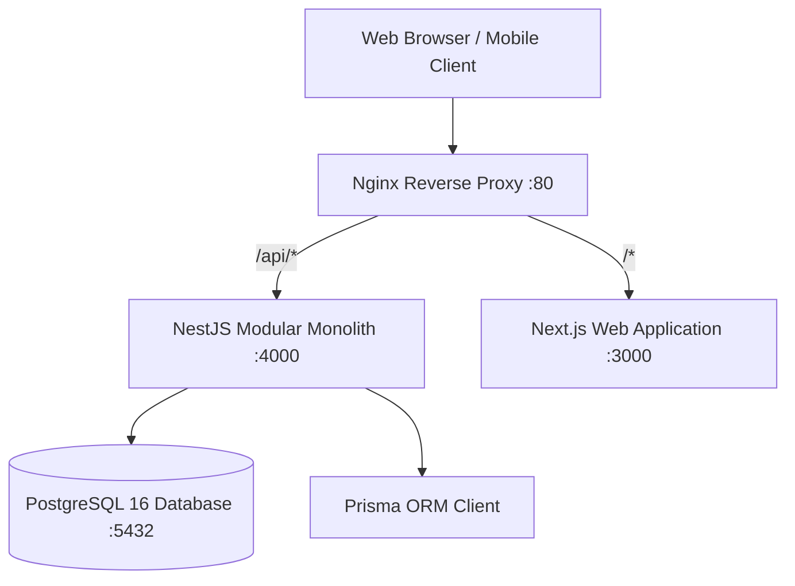

# PeopleOS HRMS — System Architecture

## 1. High-Level Overview

PeopleOS is an enterprise-grade, self-hosted Human Resource Management System (HRMS) built specifically for organizations requiring full data sovereignty on private datacenter infrastructure.

### Architectural Core Principles

- **Modular Monolith**: A unified codebase organized strictly by clear domain module boundaries. No premature microservices overhead, but decoupled enough that any module (such as Attendance, Leave, or Payroll in future phases) can be extracted into an independent microservice if needed.
- **Zero Cloud Rent / Self-Hosted Sovereignty**: No mandatory SaaS services, external cloud subscriptions, or vendor-locked vendor APIs. Runs completely on Linux/Docker with PostgreSQL.
- **Centralized Design System**: Cohesive warm-professional UI tokens, robust accessibility, responsive behavior (Desktop-first for Admin/HR, Mobile-first for Employee workflows).
- **Role-Based Governance**: Four clean user-facing personas (`ADMIN`, `HR`, `MANAGER`, `EMPLOYEE`) powered internally by a granular permission catalog.



## 2. Monorepo Structure

```
├── apps/
│   ├── api/                  # NestJS Modular Backend
│   └── web/                  # Next.js 14 Web Frontend
├── packages/
│   ├── config/               # Shared tokens, navigation & environment constants
│   ├── database/             # Prisma schema, migrations, seed & client
│   ├── eslint-config/        # Shared linting configuration
│   ├── types/                # Shared TypeScript models & API envelopes
│   └── ui/                   # Reusable HRMS design system & component library
├── infrastructure/
│   ├── docker/               # Production & Dev Dockerfiles & compose
│   ├── monitoring/           # Prometheus scraping & health monitor configs
│   ├── nginx/                # Nginx reverse proxy configuration
│   └── postgres/             # PostgreSQL init scripts & extensions
└── docs/                     # Comprehensive architecture & engineering documentation
```

## 3. Four Core Roles

1. **ADMIN**: Full system administration, branch configuration, audit log inspection, and tenant setup.
2. **HR**: Organization directory, company-wide attendance monitoring, leave master, and document management.
3. **MANAGER**: Direct squad supervision, team attendance verification, leave approvals, and official visit authorizations.
4. **EMPLOYEE**: Personal attendance punch (Office / OD / WFH), leave applications, documents, and notifications.

## 4. Future Attendance Architectural Modes (Requirement 25)

1. **OFFICE**: Attendance validation strictly against branch GPS coordinates within the organization-defined radius (e.g. 150m).
2. **OFFICIAL VISIT (OD)**: Allows outdoor duty punch outside the office perimeter when supported by an approved Official Visit workflow.
3. **WORK FROM HOME (WFH)**: Remote check-in authorized through manager-approved remote work requests.
