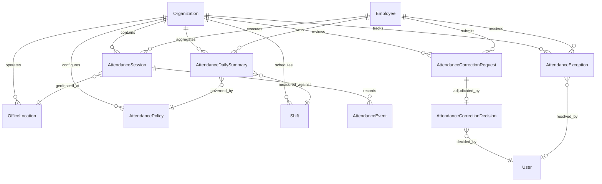
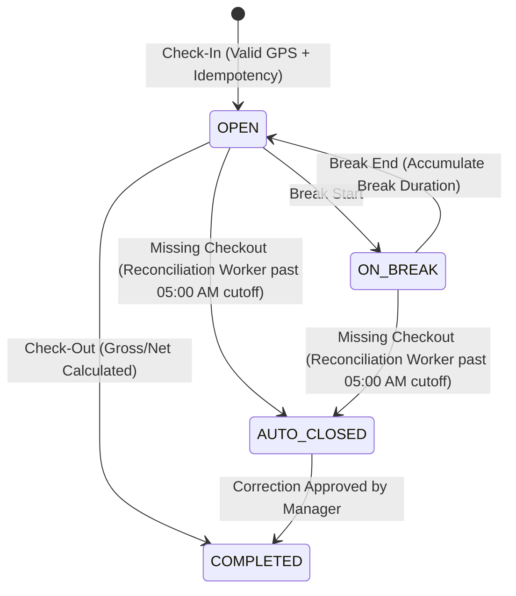
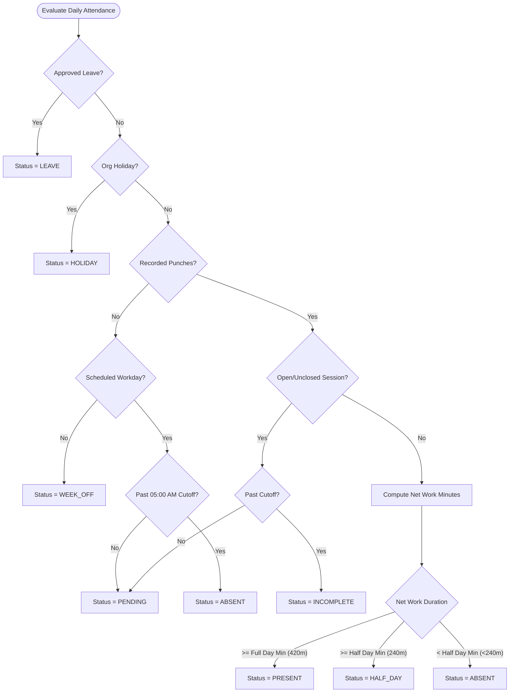

# Attendance Engine Architecture & Data Model

## 1. System Overview

The PeopleOS HRMS Attendance Engine is architected around two core design principles:

1. **Immutable Append-Only Audit Trail**: Every physical action (punch-in, punch-out, break interval) is captured as an immutable event with cryptographic-grade audit properties (authoritative UTC timestamps, raw GPS coordinates, accuracy tolerances, device signatures, IP, and geofence evaluation results).
2. **Deterministic State Reconciliation**: Daily work metrics (gross hours, break deductions, net working time, late arrival, early departure, overtime candidacy, and attendance status) are calculated using a pure function calculation engine that guarantees reproducible results across any timezone or daylight saving transition.

---

## 2. Entity Relationship Model



---

## 3. Core Database Entities

### 3.1 AttendanceSession (`attendance_sessions`)

Represents an uninterrupted active work block for an employee on a specific working date.

```prisma
model AttendanceSession {
  id                String            @id @default(uuid())
  organizationId    String
  employeeId        String
  date              DateTime          // Normalized UTC midnight date
  sessionNumber     Int               @default(1)
  checkInTime       DateTime          // Authoritative UTC
  checkOutTime      DateTime?         // Authoritative UTC
  totalWorkMinutes  Int               @default(0)
  totalBreakMinutes Int               @default(0)
  status            SessionStatus     @default(OPEN) // OPEN, ON_BREAK, COMPLETED, AUTO_CLOSED
  events            AttendanceEvent[]
  createdAt         DateTime          @default(now())
  updatedAt         DateTime          @updatedAt

  @@unique([employeeId, date, sessionNumber])
  @@index([organizationId])
  @@index([employeeId, date])
  @@index([status])
}
```

### 3.2 AttendanceEvent (`attendance_events`)

The immutable log of physical punch activities. Once inserted, events cannot be updated or physically deleted.

```prisma
model AttendanceEvent {
  id                   String            @id @default(uuid())
  organizationId       String
  employeeId           String
  sessionId            String?
  eventType            EventType         // CHECK_IN, CHECK_OUT, BREAK_START, BREAK_END
  eventTime            DateTime          @default(now())

  // Geolocation & Hardware Metadata
  latitude             Float
  longitude            Float
  accuracyMeters       Float?
  deviceInfo           String?
  ipAddress            String?
  userAgent            String?

  // Verification Verdicts
  isInsideGeofence     Boolean           @default(false)
  distanceMeters       Int?
  officeLocationId     String?
  idempotencyKey       String?           @unique

  createdAt            DateTime          @default(now())
}
```

### 3.3 AttendanceDailySummary (`attendance_daily_summaries`)

The single source of truth for an employee's attendance state on a given calendar working day.

```prisma
model AttendanceDailySummary {
  id                   String              @id @default(uuid())
  organizationId       String
  employeeId           String
  date                 DateTime            // UTC midnight

  firstCheckIn         DateTime?
  lastCheckOut         DateTime?
  grossMinutes         Int                 @default(0)
  breakMinutes         Int                 @default(0)
  breakDeductionMinutes Int                @default(0)
  netWorkMinutes       Int                 @default(0)
  netWorkHours         Float               @default(0.0)

  // Status & Metrics
  status               AttendanceDayStatus @default(PENDING) // PRESENT, HALF_DAY, ABSENT, WEEK_OFF, HOLIDAY, LEAVE, INCOMPLETE, PENDING
  isLate               Boolean             @default(false)
  lateMinutes          Int                 @default(0)
  isEarlyDeparture     Boolean             @default(false)
  earlyDepartureMinutes Int                @default(0)
  isOvertimeCandidate  Boolean             @default(false)
  overtimeMinutes      Int                 @default(0)

  // Shift & Policy Associations
  shiftId              String?
  policyId             String?
  isCorrected          Boolean             @default(false)
  correctionNotes      String?
}
```

### 3.4 AttendanceCorrectionRequest & Decision

Enforces an auditable maker-checker approval lifecycle for attendance regularizations.

- **Request**: Captures requested check-in/out timestamps, target working date, justification reason, and optional evidence metadata.
- **Decision**: Records the manager or HR decision (`APPROVED` or `REJECTED`), reviewer user ID, review notes, and exact decision timestamp.
- **Self-Approval Guard**: The system cryptographically ensures `employee.userId !== reviewer.id`, preventing employees or managers from approving their own punches.

---

## 4. State Machines

### 4.1 AttendanceSession State Machine



### 4.2 AttendanceDayStatus Resolution Hierarchy



---

## 5. Security & Concurrency Controls

1. **Transactional Row Locking**:
   - Punch operations execute inside serializable/isolated Prisma transactions (`tx.$transaction`).
   - Active session lookups query with unique compound keys `[employeeId, date, sessionNumber]`, preventing parallel check-in race conditions.
2. **Client-Side Idempotency Keys**:
   - Every punch request requires an `idempotencyKey` UUID generated by the client.
   - Replay requests with the exact same key return the previously cached successful response with `isIdempotentReplay: true`, preventing double-punching from UI double-clicks or unstable mobile networks.
3. **Hardware & Geofence Tamper Resistance**:
   - Geolocation checks run server-side using the Haversine formula against immutable coordinates configured by HR Admins.
   - Client timestamps are verified against server NTP clock; readings exceeding 5 minutes of drift are rejected.
4. **Data Scoping Enforcement**:
   - Manager queries automatically resolve reporting trees using recursive Common Table Expressions (CTEs) in [`hierarchy.service.ts`](file:///c:/Kuldeep's%20Work/Projects/HR/apps/api/src/modules/employees/hierarchy.service.ts).
   - Managers cannot query employees outside their branch/department or subordinate subtree.
