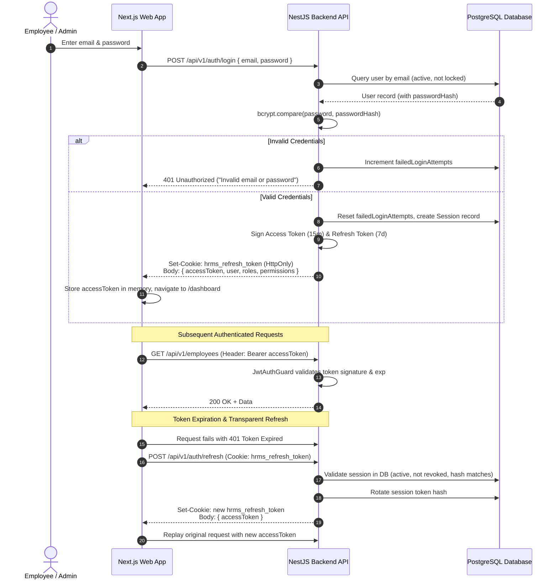
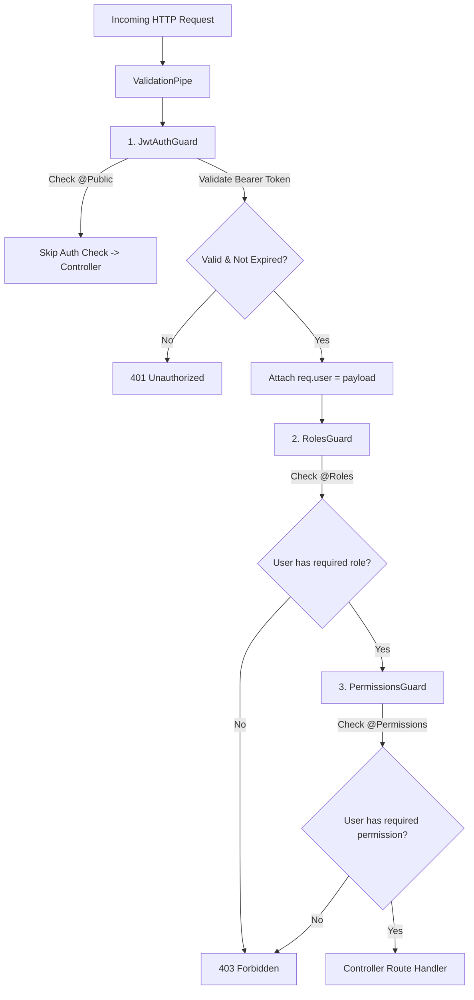

# PeopleOS HRMS — Phase 2 Architecture & Implementation Plan

## Authentication, Sessions, Roles, Permissions & Authorization

**Project:** PeopleOS Enterprise Self-Hosted HRMS  
**Phase:** Phase 2 — Step 1 Architecture Review & Master Plan  
**Status:** Architecture Blueprint (Awaiting Implementation Approval)  
**Author:** Lead Software Architect & Principal Engineering Team

---

## Executive Summary & Phase 1 Audit

Phase 1 established the foundational monorepo, PostgreSQL 16 schema with 11 core entities, a centralized warm-ivory design system (`@hrms/ui`, `@hrms/config`), an interactive application shell (`AppShell`, `Sidebar`, `Header`, `GlobalSearch`), and 19 functional frontend routes operated via a mock persona switcher (`RoleContext`).

This review evaluates the entire existing codebase across 13 architectural dimensions to establish a rigorous, production-grade foundation for **Phase 2: Authentication + Sessions + Roles + Permissions + Authorization**.

---

## Comprehensive Review of Phase 1 Implementation

### 1. Frontend Architecture

- **Current State:** Next.js 14 App Router under `apps/web/src/app`. All 19 screens render within `AppShell` wrapped by `RoleProvider` in `apps/web/src/app/layout.tsx`. Role switching operates through `localStorage.getItem('hrms_preview_role')` with four static mock profiles (`ROLE_PRESETS`).
- **What to Reuse:** The entire page hierarchy, UI layout, data display structures, and `NAVIGATION_CONFIG` mappings.
- **What Needs Modification:**
  - App Router layout structure needs an unauthenticated route group `(auth)/login` separate from authenticated workspace routes `(dashboard)`.
  - Replace client-side mock `RoleContext` with a full-featured `AuthContext` that manages actual session state, authenticated user profile, active roles, and granted permissions.
  - Integrate an API client (Axios or fetch wrapper) equipped with automatic Bearer token injection, transparent 401 refresh token rotation, and 403 authorization handlers.
- **What is Missing:** A dedicated `/login` page styled with the warm ivory design system, Next.js Edge Middleware (`middleware.ts`) for route-level access control, session expiration toast notifications, and an access-denied (403) screen.

### 2. Backend Architecture

- **Current State:** NestJS 10 modular monolith under `apps/api/src`. Entry point `main.ts` configures global validation pipes, global exception filters, and response/logging interceptors. Fourteen domain modules are registered in `app.module.ts`.
- **What to Reuse:** Global pipeline architecture (`AllExceptionsFilter`, `TransformInterceptor`, `LoggingInterceptor`), Swagger documentation configuration, and module structure.
- **What Needs Modification:** `AuthModule` currently returns hardcoded mock strings (`mock_jwt_token_for_${role}`). It must be rebuilt with real Passport strategies, JWT service, password hashing, and session management.
- **What is Missing:** `@nestjs/jwt`, `@nestjs/passport`, `passport`, `passport-jwt`, `bcrypt`, `cookie-parser`, and `@nestjs/throttler` dependencies. Real authorization guards (`JwtAuthGuard`, `RolesGuard`, `PermissionsGuard`) and decorators (`@CurrentUser`, `@Public`, `@Roles`, `@Permissions`).

### 3. Prisma Schema

- **Current State:** Located at `packages/database/prisma/schema.prisma`. Defines 11 foundational tables: `Organization`, `Branch`, `Department`, `Designation`, `User`, `Role`, `Permission`, `UserRole`, `RolePermission`, `AuditLog`, `SystemSetting`.
- **What to Reuse:** The normalized structure of `User`, `Role`, `Permission`, `UserRole`, `RolePermission`, and `AuditLog`. The explicit relational mappings and indexes are already high quality.
- **What Needs Modification:**
  - `User` model lacks security attributes: failed login counter, lockout timestamp, and last login IP.
- **What is Missing:**
  - `Session` (or `RefreshToken`) table for stateful server-side token management, device auditing, and instant session revocation.

### 4. Existing Database Models & Seed Data

- **Current State:** `packages/database/prisma/seed.ts` seeds `Organization` (`PEOPLEOS`), `Branch` (`BLR-HQ`), `Department` (`ENG`, `HR`), `Designation` (`SE-2`), 4 `Role` records (`ADMIN`, `HR`, `MANAGER`, `EMPLOYEE`), 4 `User` records, and maps them in `UserRole`.
- **What to Reuse:** Established UUID seeds and organizational hierarchy.
- **What Needs Modification:** Seeded user password hashes are dummy strings (`$2b$10$eO0gWpS3...`). They must be generated using real bcrypt hashes with known development credentials (e.g., `Password@123`).
- **What is Missing:** Seed data does not populate `Permission` or `RolePermission`. The granular permission catalog exists only as an in-memory array in `apps/api/src/modules/permissions/permissions.module.ts`.

### 5. API Structure

- **Current State:** Uniform envelope `ApiResponse<T>`:
  ```json
  { "success": true, "message": "...", "data": {}, "meta": {} }
  ```
  Swagger UI exposed at `/api/docs`.
- **What to Reuse:** The response and error serialization envelopes.
- **What Needs Modification:** Remove in-memory fallback mocks from controllers; return real data or appropriate HTTP status codes.
- **What is Missing:** Auth endpoints (`/auth/login`, `/auth/refresh`, `/auth/logout`, `/auth/me`, `/auth/sessions`, `/auth/sessions/:id`), User password change/reset endpoints, and Role/Permission assignment endpoints.

### 6. Environment Configuration

- **Current State:** `.env` and `.env.example` specify `DATABASE_URL`, `POSTGRES_PORT=5434`, `PORT=4000`, `API_PREFIX=api/v1`, `JWT_SECRET`, `JWT_EXPIRATION=8h`, `CORS_ORIGIN=http://localhost:3000`.
- **What to Reuse:** Host-isolated Postgres port configuration (`5434`).
- **What Needs Modification:** Replace single `JWT_EXPIRATION=8h` with dual-token configuration: short-lived access tokens (`15m`) and long-lived refresh tokens (`7d`).
- **What is Missing:** `JWT_REFRESH_SECRET`, `COOKIE_SECRET`, `BCRYPT_SALT_ROUNDS=12`, `THROTTLE_TTL=60`, `THROTTLE_LIMIT=10`.

### 7. Docker Configuration

- **Current State:** `docker-compose.yml` runs `postgres` (16-alpine), `api` (`Dockerfile.api`), `web` (`Dockerfile.web`), and `nginx` (`nginx:alpine`).
- **What to Reuse:** Container topology, network bridging (`hrms_network`), and volume mounting.
- **What Needs Modification:** Pass new JWT and session environment variables into `api` service definition.
- **What is Missing:** Redis service container (optional, but database-backed sessions in PostgreSQL avoid extra infrastructure overhead for self-hosted deployments).

### 8. Existing Design System

- **Current State:** Token architecture in `packages/config/src/index.ts` (warm ivory `#FAF8F5`, warm amber `50`-`900`, deep charcoal typography `#1C1917`). Component primitives in `@hrms/ui` (`Button`, `Input`, `FormControls`, `FeedbackStates`, `LayoutCards`, `Overlays`, etc.).
- **What to Reuse:** All existing UI primitives. The login screen and auth modals must directly consume `Card`, `Input`, `Button`, `Badge`, and `FeedbackStates`.
- **What Needs Modification:** None. Visual tokens must remain strictly preserved.
- **What is Missing:** Auth-specific UI views: Login form card, Session active devices list card, Role & Permission assignment drawer.

### 9. Existing Dashboard Shell

- **Current State:** `AppShell.tsx` renders desktop and mobile sidebars, sticky header with role switcher, breadcrumbs, and content container.
- **What to Reuse:** Layout responsive behavior, breadcrumb generation, command palette trigger.
- **What Needs Modification:**
  - Header's quick "Role Switcher" pill was designed for Phase 1 previewing. In Phase 2, this must be transitioned into an administrative "Impersonation / Role Testing Mode" accessible only to users with the `ADMIN` role, or replaced with the real authenticated user context.
  - Logout in `UserMenu` must invoke the backend `/auth/logout` endpoint, clear tokens, and navigate to `/login`.
- **What is Missing:** Conditional layout rendering so unauthenticated routes do not render sidebar or top header.

### 10. Existing Navigation System

- **Current State:** `NAVIGATION_CONFIG` maps navigation arrays for `ADMIN`, `HR`, `MANAGER`, `EMPLOYEE`. `Sidebar.tsx` and `GlobalSearch.tsx` filter by active role.
- **What to Reuse:** Navigation item data structures and Lucide icon mappings.
- **What Needs Modification:** Navigation filtering must support granular permissions: `requiredPermission?: string`. If an employee has custom delegated permissions, their menu must adapt accordingly.
- **What is Missing:** Dynamic permission evaluation helper in navigation rendering.

### 11. Existing Error Handling

- **Current State:** `AllExceptionsFilter` catches exceptions and formats structured JSON errors. Next.js `error.tsx` provides client-side error fallback.
- **What to Reuse:** Standard error JSON format and client error boundary.
- **What Needs Modification:** Explicit handling for `UnauthorizedException` (401) and `ForbiddenException` (403) with user-friendly error messages that do not leak sensitive backend internals.
- **What is Missing:** Frontend HTTP interceptor handling token refresh on 401 and redirecting to login on failure.

### 12. Existing Logging

- **Current State:** `LoggingInterceptor` logs HTTP method, URL, and execution time in ms.
- **What to Reuse:** Global request-response execution timing.
- **What Needs Modification:** Mask sensitive payload fields (passwords, refresh tokens) so they never appear in application stdout logs.
- **What is Missing:** Security event logging for failed logins, account lockouts, privilege escalations, and token revocations.

### 13. Existing Audit Implementation

- **Current State:** `AuditLog` table defined in Prisma. `AuditModule` provides mock read endpoint.
- **What to Reuse:** `AuditLog` schema fields (`organizationId`, `userId`, `action`, `entity`, `entityId`, `oldValues`, `newValues`, `ipAddress`, `userAgent`).
- **What Needs Modification:** Transition `AuditService` from returning mock arrays to writing and querying live records in PostgreSQL.
- **What is Missing:** Automatic audit trigger hooks for security actions: `LOGIN_SUCCESS`, `LOGIN_FAILURE`, `LOGOUT`, `ROLE_ASSIGNED`, `ROLE_REVOKED`, `PERMISSION_CHANGED`, `SESSION_REVOKED`.

---

## Architectural Problems & Security Vulnerabilities in Current Codebase

| Area                   | Current State / Risk                                                              | Impact                                                                            | Phase 2 Remedy                                                                                           |
| :--------------------- | :-------------------------------------------------------------------------------- | :-------------------------------------------------------------------------------- | :------------------------------------------------------------------------------------------------------- |
| **Authentication**     | Mock login in `auth.module.ts` returns dummy token without password verification. | Anyone can access any role or data without credentials.                           | Implement bcrypt password validation and dual-token JWT flow (access + refresh).                         |
| **Token Lifetime**     | `.env` has single `JWT_EXPIRATION=8h`.                                            | If an 8-hour token is compromised, it cannot be revoked before expiry.            | 15-minute access token + rotating refresh token stored in PostgreSQL `Session` table.                    |
| **Token Storage**      | LocalStorage used for persona switching.                                          | LocalStorage is vulnerable to Cross-Site Scripting (XSS) extraction.              | Access token kept in memory; refresh token stored in `HttpOnly`, `SameSite=Lax`, `Secure` cookie.        |
| **Brute Force**        | No rate limiting on login endpoint.                                               | Susceptible to credential stuffing and brute-force password guessing.             | Install `@nestjs/throttler` (max 5 login attempts per minute per IP) and account lockout policy.         |
| **User Enumeration**   | Error messages differentiate "User not found" from "Wrong password".              | Attackers can verify valid corporate email addresses.                             | Generic response: _"Invalid email or password"_.                                                         |
| **Credential Masking** | Passwords might be serialized in Prisma queries.                                  | Data exposure risk in user listings or audit logs.                                | Prisma select excludes `passwordHash`; DTOs use `class-transformer` `@Exclude()`.                        |
| **CORS Policy**        | `main.ts` sets `origin: process.env.CORS_ORIGIN \|\| '*'`.                        | Wildcard origin with `credentials: true` violates browser security standards.     | Explicit origin matching for allowed frontend URLs (`http://localhost:3000`).                            |
| **Authorization**      | Zero guards active on controllers.                                                | Any endpoint can be hit directly via curl/fetch without authentication.           | Global `JwtAuthGuard` by default; opt-out via `@Public()`; RBAC via `RolesGuard` and `PermissionsGuard`. |
| **Session Control**    | Pure stateless JWT prevents administrative revoking of sessions.                  | Terminated employees or compromised credentials retain access until token expiry. | Server-side `Session` table with instant single or global session revocation.                            |

---

## 1. Authentication Architecture

### 1.1 Dual-Token Pattern

PeopleOS implements a **Short-Lived Access Token + Rotating Refresh Token** pattern:

1. **Access Token (JWT):**
   - **Lifespan:** 15 minutes.
   - **Storage:** Client-side memory (React state / closure). Never persisted to `localStorage` or `sessionStorage`.
   - **Payload:** Minimal claims to prevent token bloat:
     ```json
     {
       "sub": "usr_uuid",
       "orgId": "org_uuid",
       "email": "employee@peopleos.local",
       "roles": ["EMPLOYEE"],
       "sessionId": "ses_uuid",
       "iat": 1728388800,
       "exp": 1728389700
     }
     ```
2. **Refresh Token (Opaque / Signed JWT):**
   - **Lifespan:** 7 days.
   - **Storage:** Transmitted exclusively in an `HttpOnly`, `SameSite=Lax`, `Secure` (in production), `Path=/api/v1/auth` cookie named `hrms_refresh_token`.
   - **Database Tracking:** Stored as a cryptographic SHA-256 hash in the `sessions` table.
   - **Rotation:** Every call to `/api/v1/auth/refresh` issues a new access token AND a new refresh token, invalidating the old refresh token.
   - **Reuse Detection:** If an already-rotated refresh token is presented, the system detects a token reuse attack, immediately revokes all sessions for that user, logs a high-severity security alert in `AuditLog`, and forces re-authentication.



### 1.2 Password Hashing & Security

- **Algorithm:** `bcrypt` with work factor (salt rounds) = 12.
- **Password Policy:**
  - Minimum 8 characters, maximum 128 characters.
  - At least one uppercase letter, one lowercase letter, one digit, and one special character.
  - Checked on backend using `class-validator` regex pattern.
- **Timing Attack Prevention:** When a user is not found by email, the backend still executes a dummy bcrypt compare against a constant hash to maintain constant response timing.

### 1.3 Rate Limiting & Account Lockout

- **Rate Limiting:** Managed via `@nestjs/throttler`. Login endpoint is restricted to 5 attempts per minute per IP.
- **Account Lockout:**
  - After 5 consecutive failed login attempts, the account is locked for 15 minutes (`lockedUntil = now() + 15m`).
  - An audit log entry (`AUTH_ACCOUNT_LOCKED`) is recorded.
  - An administrator can manually unlock the account via `/users/:id/unlock`.

---

## 2. Session Architecture

### 2.1 Stateful Session Lifecycle in PostgreSQL

While access tokens are stateless for maximum API throughput, refresh tokens and active user devices are **stateful** to fulfill enterprise governance requirements:

1. **Device Identification:** Upon login, the backend parses `User-Agent` and client IP to record:
   - Device type (Desktop, Mobile, Tablet).
   - Browser / OS family.
   - IP address.
2. **Session Attributes:**
   - `id`: Unique UUID.
   - `userId`: Reference to `users.id`.
   - `refreshTokenHash`: SHA-256 hash of current active refresh token.
   - `userAgent`: Raw client User-Agent string.
   - `ipAddress`: Client IP.
   - `expiresAt`: Absolute expiration timestamp (7 days from creation).
   - `lastActiveAt`: Updated on each refresh cycle.
   - `isRevoked`: Boolean flag.
   - `revokedReason`: Optional explanation (e.g., `USER_LOGOUT`, `ADMIN_REVOKED`, `TOKEN_REUSE_DETECTED`).

### 2.2 Session Revocation Capabilities

- **User Self-Service:** Users can view active sessions in `/profile` and revoke specific sessions ("Log out of MacBook Pro") or all other sessions ("Log out of all other devices").
- **Admin Governance:** Administrators can view and terminate any user's active sessions in `/users/:id` or `/audit`.
- **Password Change Hook:** Changing a password automatically marks all existing sessions for that user as revoked (`isRevoked = true`), immediately terminating all devices.

---

## 3. Database Changes (Prisma Schema)

### 3.1 New Model: `Session`

Add to `packages/database/prisma/schema.prisma`:

```prisma
model Session {
  id               String       @id @default(uuid())
  userId           String
  user             User         @relation(fields: [userId], references: [id], onDelete: Cascade)

  refreshTokenHash String       @unique
  userAgent        String?
  ipAddress        String?
  deviceType       String?      // DESKTOP, MOBILE, TABLET

  isRevoked        Boolean      @default(false)
  revokedAt        DateTime?
  revokedReason    String?      // USER_LOGOUT, ADMIN_TERMINATED, TOKEN_REUSE

  expiresAt        DateTime
  lastActiveAt     DateTime     @default(now())
  createdAt        DateTime     @default(now())
  updatedAt        DateTime     @updatedAt

  @@index([userId])
  @@index([refreshTokenHash])
  @@index([isRevoked])
  @@index([expiresAt])
  @@map("sessions")
}
```

### 3.2 Additions to Existing `User` Model

Update `model User` in `schema.prisma`:

```prisma
model User {
  // Existing fields: id, organizationId, employeeCode, email, passwordHash, ...

  // Security & Lockout Additions for Phase 2:
  failedLoginAttempts Int       @default(0)
  lockedUntil         DateTime?
  lastLoginIp         String?
  passwordChangedAt   DateTime?

  // Relations:
  sessions            Session[]

  // Existing relations: userRoles, auditLogs, etc.
}
```

### 3.3 Database Migration Strategy

1. Run `pnpm --filter @hrms/database prisma migrate dev --name add_sessions_and_user_security_fields`.
2. Generate updated Prisma Client: `pnpm --filter @hrms/database prisma generate`.
3. Update `seed.ts` to insert valid bcrypt password hashes and seed the full `Permission` and `RolePermission` catalog.

---

## 4. RBAC Architecture

### 4.1 Four Core Roles & Responsibilities

| Role Code      | Display Name          | Scope                       | Key Capabilities                                                                                                                   |
| :------------- | :-------------------- | :-------------------------- | :--------------------------------------------------------------------------------------------------------------------------------- |
| **`ADMIN`**    | Super Administrator   | Organization-wide           | Full system settings, branch/dept config, audit log review, role/permission assignment, user deactivation, session termination.    |
| **`HR`**       | People Operations     | Organization-wide           | Employee directory master, leave policies & approvals, company attendance records, official visit monitoring, document management. |
| **`MANAGER`**  | Team Leader / Manager | Department / Direct Reports | Team member directory, team attendance verification, leave request approval/rejection, official visit endorsement.                 |
| **`EMPLOYEE`** | Staff Member          | Self                        | Personal attendance punch (Office/OD/WFH), leave application, personal official visit requests, profile view, own documents.       |

### 4.2 Multi-Role Resolution

- A user can have multiple assigned roles via `UserRole` (e.g., a person may be both a `MANAGER` and an `EMPLOYEE`, or an `HR` staff member who also manages a team).
- The active permissions for a user represent the **union** of all permissions granted across all active assigned roles.
- For UI navigation convenience, a primary active role is selected by default, but capabilities reflect the user's total authorized permission set.

---

## 5. Permission Architecture

### 5.1 Granular Permission Catalog

Permissions follow the standard hierarchical pattern: `<module>:<action>`.

```
organization:read        - View organization structure, branches, departments
organization:write       - Create or edit branches and departments
organization:delete      - Deactivate or delete organizational entities

employees:read           - View employee profiles and directory
employees:write          - Create, edit, or onboard employees
employees:delete         - Deactivate or archive employee accounts

attendance:read:own      - View personal attendance history
attendance:punch:own     - Mark personal attendance check-in/check-out
attendance:read:team     - View team attendance (Manager)
attendance:read:all      - View all organization attendance records (HR/Admin)
attendance:manage        - Override attendance records, shifts, and grace periods

leave:apply:own          - Submit leave requests
leave:read:own           - View personal leave balances and history
leave:approve:team       - Approve or reject direct reports' leave requests
leave:approve:all        - Administrative leave approval override (HR/Admin)
leave:manage             - Configure leave types, holiday calendar, and quotas

visits:apply:own         - Submit official visit (OD) requests
visits:approve:team      - Approve direct reports' official visit requests
visits:approve:all       - Administrative official visit approval (HR/Admin)

reports:view:team        - View team performance and attendance analytics
reports:view:all         - View enterprise MIS and executive workforce reports

roles:read               - View role definitions and assigned permissions
roles:manage             - Create roles, assign permissions, modify role mappings

audit:read               - Inspect immutable system and security audit logs

settings:read            - View system configuration
settings:manage          - Modify organization parameters and geofencing rules
```

### 5.2 Role-to-Permission Default Matrix

| Module / Permission    | ADMIN |  HR  |   MANAGER   |  EMPLOYEE   |
| :--------------------- | :---: | :--: | :---------: | :---------: |
| `organization:*`       | Full  | Read |    Read     |    None     |
| `employees:*`          | Full  | Full | Read (Team) | Read (Self) |
| `attendance:punch:own` |  Yes  | Yes  |     Yes     |     Yes     |
| `attendance:read:team` |  Yes  | Yes  |     Yes     |     No      |
| `attendance:read:all`  |  Yes  | Yes  |     No      |     No      |
| `attendance:manage`    |  Yes  | Yes  |     No      |     No      |
| `leave:apply:own`      |  Yes  | Yes  |     Yes     |     Yes     |
| `leave:approve:team`   |  Yes  | Yes  |     Yes     |     No      |
| `leave:approve:all`    |  Yes  | Yes  |     No      |     No      |
| `leave:manage`         |  Yes  | Yes  |     No      |     No      |
| `visits:apply:own`     |  Yes  | Yes  |     Yes     |     Yes     |
| `visits:approve:team`  |  Yes  | Yes  |     Yes     |     No      |
| `visits:approve:all`   |  Yes  | Yes  |     No      |     No      |
| `reports:view:all`     |  Yes  | Yes  |     No      |     No      |
| `reports:view:team`    |  Yes  | Yes  |     Yes     |     No      |
| `roles:*`              | Full  | Read |    None     |    None     |
| `audit:read`           | Full  | Read |    None     |    None     |
| `settings:*`           | Full  | Read |    None     |    None     |

### 5.3 Permission Evaluation Strategy

Permissions are resolved on user authentication or token refresh and loaded into the user's execution context. For maximum database efficiency, permissions for standard roles are pre-compiled and attached to the user session, reducing database query overhead during frequent API requests.

---

## 6. Frontend Authentication Architecture

### 6.1 Route Structure & Layout Hierarchy

Refactor `apps/web/src/app` into two route groups:

```
apps/web/src/app/
├── (auth)/
│   ├── layout.tsx              # Minimalist warm ivory layout (no sidebar/header)
│   └── login/
│       └── page.tsx            # Clean, premium login screen
├── (dashboard)/
│   ├── layout.tsx              # Wraps children in AppShell & AuthGuard
│   ├── dashboard/page.tsx
│   ├── employees/page.tsx
│   ├── attendance/page.tsx
│   ├── leave/page.tsx
│   ├── visits/page.tsx
│   ├── reports/page.tsx
│   ├── organization/page.tsx
│   ├── roles/page.tsx
│   ├── audit/page.tsx
│   ├── settings/page.tsx
│   └── ...
├── layout.tsx                  # Global HTML, font tokens, QueryClient/AuthProvider
├── error.tsx
└── not-found.tsx
```

### 6.2 Authentication State Machine (`AuthContext`)

The new `AuthContext` replaces `RoleContext` and manages:

- `user`: Current authenticated user profile (`id`, `email`, `firstName`, `lastName`, `employeeCode`, `organizationId`).
- `roles`: Array of assigned role codes (`RoleType[]`).
- `permissions`: Set of granted permission strings (`Set<string>`).
- `accessToken`: In-memory JWT access token string.
- `isAuthenticated`: Boolean derived from presence of user and valid token.
- `isLoading`: Boolean indicating initial session check on application boot.
- `login(credentials)`: Submits credentials, sets in-memory token, redirects to `/dashboard`.
- `logout()`: Calls backend `/auth/logout`, clears in-memory state, redirects to `/login`.
- `hasPermission(permission: string)`: Returns boolean if permission is present.
- `hasRole(role: RoleType)`: Returns boolean if role is present.

### 6.3 Next.js Route Protection (`middleware.ts`)

A lightweight Next.js Edge Middleware checks for the presence of the `hrms_refresh_token` session cookie:

- If a user requests a protected route under `/(dashboard)/*` without the session cookie, redirect to `/login?redirect=${encodeURIComponent(pathname)}`.
- If a logged-in user requests `/login`, redirect to `/dashboard`.
- Granular role and permission checks execute on client rendering inside the layout, preventing unauthorized views from ever rendering data.

---

## 7. Backend Authorization Architecture

### 7.1 NestJS Guard Pipeline

Execution order of NestJS guards on incoming HTTP requests:



### 7.2 Custom NestJS Decorators

1. `@Public()`: Marks route as accessible without Bearer token (e.g., `POST /auth/login`, `GET /health`).
2. `@Roles(...roles: RoleCode[])`: Restricts endpoint to specific roles (e.g., `@Roles(RoleCode.ADMIN)`).
3. `@Permissions(...perms: string[])`: Restricts endpoint to specific permissions (e.g., `@Permissions('leave:approve')`).
4. `@CurrentUser()`: Injects validated user object from request into controller method:
   ```typescript
   @Get('me')
   async getProfile(@CurrentUser() user: AuthenticatedUser) {
     return this.usersService.findById(user.id);
   }
   ```

---

## 8. Security Considerations & Hardening

1. **OWASP Top 10 Protections:**
   - **Broken Access Control:** Server-side enforcement on every single mutation and query; never trust frontend flags.
   - **Cryptographic Failures:** Bcrypt with 12 salt rounds; SHA-256 for refresh tokens; HTTPS enforcement in production; distinct secrets for access and refresh tokens.
   - **Injection:** Prisma ORM parameterized queries eliminate SQL injection risks.
   - **Security Misconfiguration:** Explicit CORS origin validation; remove Swagger docs in production if specified.
2. **Cookie Security:**
   - `HttpOnly`: Inaccessible via JavaScript (`document.cookie`), neutralizing XSS token theft.
   - `SameSite=Lax`: Defends against Cross-Site Request Forgery (CSRF).
   - `Secure`: Transmitted only over TLS/HTTPS (flag disabled in local dev via environment detection).
   - `Path=/api/v1/auth`: Cookie sent only to auth endpoints, avoiding transmission on general static asset requests.
3. **Data Sanitization:**
   - `passwordHash`, `refreshTokenHash`, and failed login metadata are excluded at the Prisma query level using explicit `select` schemas and NestJS interceptors.
4. **Audit Logging:**
   - Every authentication event (success, failure, lockout, session termination) records IP, User-Agent, and actor ID into the immutable `AuditLog` table.

---

## 9. Implementation Order

Execution must proceed in strictly linear, verifiable steps:

```
Step 1: Architecture Review & Specification Approval (CURRENT STEP)
   ├── Inspect repository, audit Phase 1 assets, identify gaps & risks
   └── Publish docs/phase-2-plan.md for review

Step 2: Dependencies & Database Schema Migration
   ├── Install backend auth packages (@nestjs/jwt, @nestjs/passport, passport, passport-jwt, bcrypt, cookie-parser, @nestjs/throttler)
   ├── Update schema.prisma with Session model and User security attributes
   ├── Run Prisma migration & client generation
   └── Update seed.ts with bcrypt hashes and granular permissions catalog

Step 3: Backend Authentication Engine
   ├── Implement AuthService (login, validateUser, generateTokens, rotateRefreshToken, logout)
   ├── Implement JwtStrategy & RefreshTokenStrategy
   ├── Implement AuthController endpoints (/auth/login, /auth/refresh, /auth/logout, /auth/me, /auth/sessions)
   └── Configure HttpOnly cookie parsing in main.ts

Step 4: Backend Authorization Engine (Guards & Decorators)
   ├── Create @Public(), @Roles(), @Permissions(), @CurrentUser() decorators
   ├── Create JwtAuthGuard, RolesGuard, PermissionsGuard
   ├── Register guards globally or apply to target controllers
   └── Wire AuditService to log security actions into PostgreSQL

Step 5: Frontend Authentication & Route Protection
   ├── Create AuthContext with in-memory token handling and transparent 401 refresh
   ├── Build high-fidelity /login page adhering to warm ivory design tokens
   ├── Implement Next.js Edge Middleware for session route protection
   ├── Refactor AppShell to consume real authenticated user profile
   └── Implement user session management view in Profile / Settings

Step 6: End-to-End Verification & Quality Audit
   ├── Validate all 4 persona logins against database
   ├── Validate RBAC route restrictions (401/403 guards)
   ├── Validate session revocation and token rotation
   └── Run Turbo typecheck, lint, and build
```

---

## 10. Testing Strategy

1. **Unit Tests:**
   - `AuthService`: Password hashing validation, token generation, refresh token hash comparison, expired session rejection.
   - `RolesGuard` & `PermissionsGuard`: Access granted when roles/permissions match; 403 thrown when claims are insufficient.
2. **Integration Tests (API Endpoints):**
   - `POST /auth/login`: Returns 200 with access token and set-cookie for valid credentials; returns 401 for incorrect password.
   - `POST /auth/refresh`: Returns new access token and rotated cookie; rejects revoked or expired sessions.
   - `POST /auth/logout`: Clears cookie and marks database session `isRevoked = true`.
   - Protected endpoints: Returns 401 without Bearer token; returns 403 with invalid role.
3. **Frontend E2E Flow:**
   - Unauthenticated user visiting `/dashboard` is redirected to `/login`.
   - Entering invalid credentials displays clean inline error card.
   - Entering valid credentials redirects to `/dashboard` with user avatar, name, and role-appropriate navigation items.
   - Clicking "Logout" clears session and redirects to `/login`.

---

## 11. Acceptance Criteria

Phase 2 will be considered complete when all of the following verifiable conditions are met:

- [ ] **Database Integrity:** Prisma migration applies cleanly; `Session` table exists with proper indexes and cascade rules; seed script successfully populates all 4 roles, permissions, and bcrypt-hashed demo users.
- [ ] **Dual-Token Flow:** Access tokens expire in 15 minutes; refresh tokens operate via `HttpOnly` cookies and rotate on each refresh call.
- [ ] **Stateful Sessions:** Active sessions appear in the database; terminating a session invalidates subsequent refresh attempts.
- [ ] **Brute-Force Defense:** Rate limiter throttles excessive login requests; 5 failed attempts trigger a 15-minute account lockout.
- [ ] **RBAC & Permission Guards:** Backend endpoints strictly enforce `@Roles()` and `@Permissions()`; unauthorized attempts return 403 Forbidden.
- [ ] **Audit Trail:** Login successes, login failures, logouts, and session terminations create persistent `AuditLog` records.
- [ ] **Design Continuity:** The `/login` page and all new auth components strictly honor Phase 1 design tokens (warm ivory background `#FAF8F5`, warm amber accents, deep charcoal typography).
- [ ] **Zero Regressions:** All 19 Phase 1 screens remain fully functional; `pnpm turbo run typecheck`, `pnpm turbo run lint`, and `pnpm turbo run build` pass with 0 errors.

---

_Awaiting user instruction before proceeding to Step 2 implementation._
