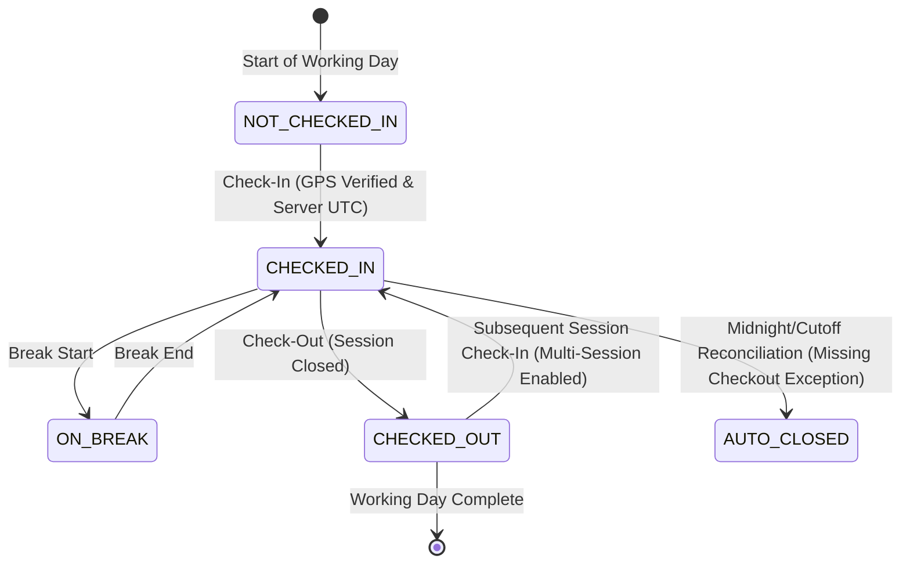
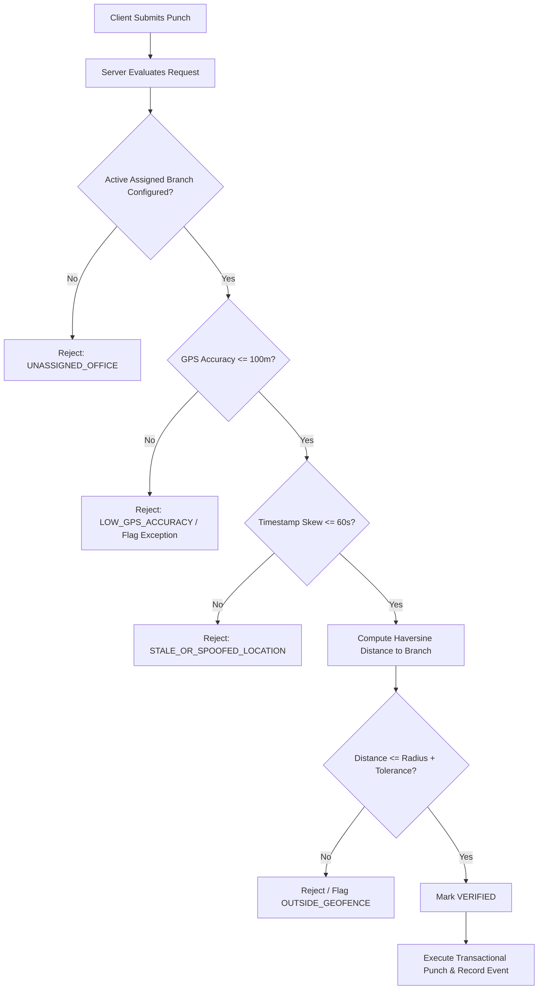
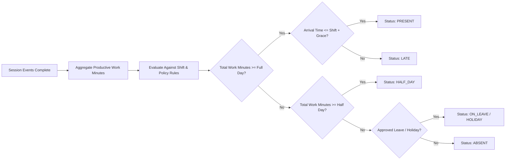
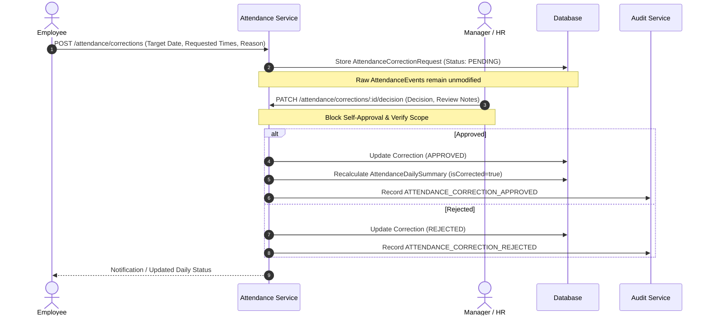

# Phase 4 — Production-Grade Attendance Engine Architecture & Implementation Plan

**System:** PeopleOS Self-Hosted Enterprise HRMS  
**Phase:** Phase 4 — Production-Grade Attendance Engine  
**Target Architecture:** Modular Monolith (NestJS + Next.js + PostgreSQL + Prisma + Docker)  
**Author:** Lead Enterprise Software Architect, NestJS Engineer, Next.js Engineer, PostgreSQL Engineer, Security Engineer & QA Lead  
**Status:** Step 1 — Architecture Review & Blueprint (Pre-Implementation)

---

## 1. Existing Reusable Models, Services, Guards and UI Components

The Phase 4 attendance engine directly leverages foundational models, services, and UI components established in Phases 1–3 without duplicating abstractions or creating architectural drift.

### 1.1 Existing Database Models (Packages/Database)

- **`Organization`**: Multi-tenant boundary root (`organizationId`), timezone definition, currency, operational settings.
- **`Branch`**: Physical offices already equipped with geofencing attributes:
  - `latitude` (Float?), `longitude` (Float?)
  - `geofenceLat` (Float?), `geofenceLng` (Float?)
  - `geofenceRadiusMeters` (Int, default: 100m)
  - `timezone` (String, default: "Asia/Kolkata")
  - `isActive` (Boolean)
- **`Employee`**: Core employment entity with `employeeCode`, `status`, `userId` link, and `managerId` hierarchy.
- **`EmployeeEmployment`**: Normalization entity linking an employee to their active assigned `branchId`, `departmentId`, `designationId`, `managerId`, and `workMode` (`OFFICE`, `HYBRID`, `REMOTE`).
- **`User`**: Account identity linked to credentials, email, status, and role assignments.
- **`Role` & `Permission`**: RBAC permissions including `ATTENDANCE_VIEW`, `ATTENDANCE_MARK`, `ATTENDANCE_UPDATE`, and `ATTENDANCE_APPROVE`.
- **`AuditLog`**: Centralized audit entity tracking tenant-scoped compliance actions.

### 1.2 Existing Backend Services & Guards (Apps/Api)

- **`PrismaService`**: Database transactions, connection pooling, and client extensions.
- **`AuditService`**: Asynchronous, sanitized audit logging (`this.auditService.record({ action, entity, entityId, userId, organizationId, metadata })`).
- **`HierarchyService`**: Controlled recursive manager hierarchy traversal (`getTeamMemberIds`, `getDirectReports`, `getManager`) for team-level data scoping.
- **Guards & Decorators**:
  - `JwtAuthGuard`: JWT extraction, token verification, session validation.
  - `RolesGuard` & `PermissionsGuard`: Role and permission evaluation against `@RequirePermissions(...)`.
  - `AccessControlService`: Dynamic data-scope evaluation (`SELF`, `TEAM`, `ORGANIZATION`, `GLOBAL`).

### 1.3 Existing Frontend Components & Design System (Packages/Ui & Apps/Web)

- **Design Tokens**: Warm ivory canvas (`#FAF8F5` / `bg-ivory-50`), stone neutrals (`stone-900`, `stone-600`, `stone-200`), deep amber accents (`amber-800`, `amber-900`), and subtle border treatments (`border-stone-200/80`).
- **Shared Components**: `AppShell`, `DataTable`, `Dialog`, `Button`, `Badge`, `KPICard`, `Avatar`, `Input`, `Search`, `Pagination`, `EmptyState`, `ErrorState`, `LoadingState`, `Toast`.
- **Context & Hooks**: `useAuth` hook providing current `user`, `hasRole`, `hasPermission`, and authenticated API client `apiClient`.

---

## 2. Attendance Workflows & State Diagrams

### 2.1 Daily Session State Machine (Work Block Lifecycle)

An employee may complete one or multiple legitimate sessions during a policy-defined working day.



### 2.2 Geofence Verification Pipeline



### 2.3 Daily Attendance Summary Evaluation Pipeline



### 2.4 Attendance Correction Workflow



---

## 3. Office Geofence & Location Validation Design

### 3.1 Mathematical Foundation (Haversine Formula)

Geospatial distances are calculated directly on the NestJS backend in pure TypeScript without any reliance on Google Maps APIs or external paid geolocation services.

Given:

- Employee coordinates: $(\phi_1, \lambda_1)$
- Branch geofence coordinates: $(\phi_2, \lambda_2)$
- Mean Earth radius: $R = 6,371,000 \text{ meters}$

$$\Delta\phi = (\phi_2 - \phi_1) \cdot \frac{\pi}{180}, \quad \Delta\lambda = (\lambda_2 - \lambda_1) \cdot \frac{\pi}{180}$$
$$a = \sin^2\left(\frac{\Delta\phi}{2}\right) + \cos\left(\phi_1 \cdot \frac{\pi}{180}\right) \cdot \cos\left(\phi_2 \cdot \frac{\pi}{180}\right) \cdot \sin^2\left(\frac{\Delta\lambda}{2}\right)$$
$$c = 2 \cdot \text{atan2}\left(\sqrt{a}, \sqrt{1 - a}\right)$$
$$d = R \cdot c$$

### 3.2 Geofence Verification Criteria

1. **Assigned Branch Matching**: Look up employee's active `EmployeeEmployment` record. Punch is evaluated strictly against their assigned branch (`branch.geofenceLat`, `branch.geofenceLng`). Client-provided branch IDs are never trusted blindly.
2. **Horizontal Accuracy Gate**: Browser-reported `accuracyMeters` must be $\le 100\text{ m}$ (configurable per policy). If reported accuracy is worse (e.g., $250\text{ m}$ due to cellular triangulation), the punch is rejected with `LOW_GPS_ACCURACY`.
3. **Location Freshness & Time Skew**: Client geolocation timestamp must be within $\pm 60\text{ seconds}$ of the server clock to prevent replay of cached coordinates.
4. **Perimeter Tolerance**: Check-in passes if $d \le (\text{geofenceRadiusMeters} + \text{accuracyThreshold})$. Default radius is $100\text{ m}$.
5. **Privacy Safeguard**: Coordinates are only captured upon explicit user action ("Punch In" / "Punch Out"). Continuous background GPS tracking is explicitly prohibited. Precise coordinates are stored in raw events and stripped from roster/list API responses.

---

## 4. Proposed Database Schema & Migration Impact

### 4.1 Schema Additions (`packages/database/prisma/schema.prisma`)

```prisma
// =============================================================================
// PHASE 4: ATTENDANCE ENGINE ENUMS & MODELS
// =============================================================================

enum AttendanceMode {
  OFFICE
  OFFICIAL_VISIT  // Reserved: Not permitted without future Phase 5 approval
  WFH             // Reserved: Not permitted without future Phase 5 approval
}

enum AttendanceEventType {
  CHECK_IN
  CHECK_OUT
  BREAK_START
  BREAK_END
}

enum GeofenceVerificationStatus {
  VERIFIED
  OUTSIDE_GEOFENCE
  LOW_ACCURACY
  EXEMPT
  FAILED
}

enum AttendanceDayStatus {
  PRESENT
  HALF_DAY
  LATE
  ABSENT
  ON_LEAVE
  HOLIDAY
  WEEKEND_OFF
  PENDING
}

enum CorrectionStatus {
  PENDING
  APPROVED
  REJECTED
  CANCELLED
}

enum AttendanceExceptionType {
  OUTSIDE_GEOFENCE
  LOW_GPS_ACCURACY
  MISSING_CHECKOUT
  OVERLAPPING_SESSION
  SUSPICIOUS_TIMING
  POLICY_VIOLATION
}

enum SessionStatus {
  OPEN
  COMPLETED
  AUTO_CLOSED
}

// -----------------------------------------------------------------------------
// 1. Shift & Policy Configuration
// -----------------------------------------------------------------------------

model AttendancePolicy {
  id                        String       @id @default(uuid())
  organizationId            String
  organization              Organization @relation(fields: [organizationId], references: [id], onDelete: Cascade)
  branchId                  String?      // Optional branch-specific policy override

  name                      String
  code                      String
  isDefault                 Boolean      @default(false)

  // Working hour rules (minutes)
  standardWorkMinutes       Int          @default(480) // 8 hours
  halfDayThresholdMinutes   Int          @default(240) // 4 hours
  fullDayThresholdMinutes   Int          @default(420) // 7 hours
  gracePeriodMinutes        Int          @default(15)  // 15 min grace before marked LATE
  maxCheckInDelayMinutes    Int          @default(120) // After 2 hours, half-day/absent rule

  // Break rules
  maxDailyBreakMinutes      Int          @default(60)  // Total break duration allowed
  maxSingleBreakMinutes     Int          @default(45)  // Longest continuous break

  // Concurrency & Overtime
  allowMultipleSessions     Boolean      @default(true)
  overnightShiftAllowed     Boolean      @default(false)
  workingDayStartHour       Int          @default(5)   // 05:00 AM cutoff for overnight day boundary

  // Geofence enforcement
  geofenceEnforcement       Boolean      @default(true)
  maxGpsAccuracyMeters      Int          @default(100)

  // Policy versioning
  version                   Int          @default(1)
  effectiveFrom             DateTime     @default(now())
  effectiveTo               DateTime?

  createdAt                 DateTime     @default(now())
  updatedAt                 DateTime     @updatedAt

  shifts                    Shift[]
  dailySummaries            AttendanceDailySummary[]

  @@unique([organizationId, code, version])
  @@index([organizationId])
  @@index([branchId])
  @@index([effectiveFrom])
  @@map("attendance_policies")
}

model Shift {
  id                   String            @id @default(uuid())
  organizationId       String
  organization         Organization      @relation(fields: [organizationId], references: [id], onDelete: Cascade)
  policyId             String?
  policy               AttendancePolicy? @relation(fields: [policyId], references: [id], onDelete: SetNull)

  name                 String
  code                 String
  startTime            String            // "09:00" in 24h format
  endTime              String            // "18:00" in 24h format
  isOvernight          Boolean           @default(false)
  workDays             Int[]             @default([1, 2, 3, 4, 5]) // 1=Mon, 7=Sun
  breakDurationMinutes Int               @default(60)
  isActive             Boolean           @default(true)

  createdAt            DateTime          @default(now())
  updatedAt            DateTime          @updatedAt

  assignments          ShiftAssignment[]
  dailySummaries       AttendanceDailySummary[]

  @@unique([organizationId, code])
  @@index([organizationId])
  @@index([isActive])
  @@map("shifts")
}

model ShiftAssignment {
  id             String       @id @default(uuid())
  organizationId String
  organization   Organization @relation(fields: [organizationId], references: [id], onDelete: Cascade)
  employeeId     String
  employee       Employee     @relation(fields: [employeeId], references: [id], onDelete: Cascade)
  shiftId        String
  shift          Shift        @relation(fields: [shiftId], references: [id], onDelete: Cascade)

  effectiveFrom  DateTime
  effectiveTo    DateTime?
  assignedById   String?
  assignedBy     User?        @relation(fields: [assignedById], references: [id], onDelete: SetNull)

  createdAt      DateTime     @default(now())
  updatedAt      DateTime     @updatedAt

  @@index([organizationId])
  @@index([employeeId])
  @@index([shiftId])
  @@index([effectiveFrom, effectiveTo])
  @@map("shift_assignments")
}

// -----------------------------------------------------------------------------
// 2. Attendance Sessions & Raw Audit Events
// -----------------------------------------------------------------------------

model AttendanceSession {
  id                String            @id @default(uuid())
  organizationId    String
  organization      Organization      @relation(fields: [organizationId], references: [id], onDelete: Cascade)
  employeeId        String
  employee          Employee          @relation(fields: [employeeId], references: [id], onDelete: Cascade)

  date              DateTime          // Normalized to midnight in branch timezone
  sessionNumber     Int               @default(1)

  checkInTime       DateTime
  checkOutTime      DateTime?
  totalWorkMinutes  Int               @default(0)
  totalBreakMinutes Int               @default(0)
  status            SessionStatus     @default(OPEN)

  events            AttendanceEvent[]

  createdAt         DateTime          @default(now())
  updatedAt         DateTime          @updatedAt

  @@unique([employeeId, date, sessionNumber])
  @@index([organizationId])
  @@index([employeeId, date])
  @@index([status])
  @@map("attendance_sessions")
}

model AttendanceEvent {
  id                      String                     @id @default(uuid())
  organizationId          String
  organization            Organization               @relation(fields: [organizationId], references: [id], onDelete: Cascade)
  employeeId              String
  employee                Employee                   @relation(fields: [employeeId], references: [id], onDelete: Cascade)
  sessionId               String?
  session                 AttendanceSession?         @relation(fields: [sessionId], references: [id], onDelete: SetNull)

  eventType               AttendanceEventType
  eventTimestamp          DateTime                   @default(now()) // Authoritative server UTC
  attendanceMode          AttendanceMode             @default(OFFICE)

  // Geolocation snapshot
  latitude                Float?
  longitude               Float?
  accuracyMeters          Float?
  branchId                String?
  branch                  Branch?                    @relation(fields: [branchId], references: [id], onDelete: SetNull)
  distanceFromOfficeMeters Float?
  geofenceStatus          GeofenceVerificationStatus @default(VERIFIED)

  // Integrity & Anti-Replay
  idempotencyKey          String                     @unique
  deviceInfo              String?
  ipAddress               String?
  actorUserId             String
  actorUser               User                       @relation(fields: [actorUserId], references: [id], onDelete: Restrict)
  metadata                Json?

  createdAt               DateTime                   @default(now())

  @@index([organizationId])
  @@index([employeeId])
  @@index([eventTimestamp])
  @@index([idempotencyKey])
  @@map("attendance_events")
}

// -----------------------------------------------------------------------------
// 3. Calculated Daily Summaries
// -----------------------------------------------------------------------------

model AttendanceDailySummary {
  id                String              @id @default(uuid())
  organizationId    String
  organization      Organization        @relation(fields: [organizationId], references: [id], onDelete: Cascade)
  employeeId        String
  employee          Employee            @relation(fields: [employeeId], references: [id], onDelete: Cascade)
  date              DateTime            // Normalized working day

  firstCheckIn      DateTime?
  lastCheckOut      DateTime?
  totalWorkMinutes  Int                 @default(0)
  totalBreakMinutes Int                 @default(0)
  lateMinutes       Int                 @default(0)
  earlyExitMinutes  Int                 @default(0)
  overtimeMinutes   Int                 @default(0)

  status            AttendanceDayStatus @default(PENDING)
  shiftId           String?
  shift             Shift?              @relation(fields: [shiftId], references: [id], onDelete: SetNull)
  policyId          String?
  policy            AttendancePolicy?   @relation(fields: [policyId], references: [id], onDelete: SetNull)

  isCorrected       Boolean             @default(false)
  correctionNotes   String?

  createdAt         DateTime            @default(now())
  updatedAt         DateTime            @updatedAt

  @@unique([organizationId, employeeId, date])
  @@index([organizationId, date])
  @@index([employeeId, date])
  @@index([status])
  @@map("attendance_daily_summaries")
}

// -----------------------------------------------------------------------------
// 4. Corrections, Decisions & Exceptions
// -----------------------------------------------------------------------------

model AttendanceCorrectionRequest {
  id                 String                        @id @default(uuid())
  organizationId     String
  organization       Organization                  @relation(fields: [organizationId], references: [id], onDelete: Cascade)
  employeeId         String
  employee           Employee                      @relation(fields: [employeeId], references: [id], onDelete: Cascade)

  targetDate         DateTime
  requestedCheckIn   DateTime?
  requestedCheckOut  DateTime?
  reason             String
  status             CorrectionStatus              @default(PENDING)

  decision           AttendanceCorrectionDecision?
  submittedAt        DateTime                      @default(now())
  updatedAt          DateTime                      @updatedAt

  @@index([organizationId])
  @@index([employeeId])
  @@index([status])
  @@index([targetDate])
  @@map("attendance_correction_requests")
}

model AttendanceCorrectionDecision {
  id                   String                       @id @default(uuid())
  requestId            String                       @unique
  request              AttendanceCorrectionRequest  @relation(fields: [requestId], references: [id], onDelete: Cascade)

  reviewerId           String
  reviewer             User                         @relation(fields: [reviewerId], references: [id], onDelete: Restrict)

  decision             CorrectionStatus
  originalWorkMinutes  Int
  correctedWorkMinutes Int
  reviewNotes          String
  decidedAt            DateTime                     @default(now())

  @@index([reviewerId])
  @@index([decidedAt])
  @@map("attendance_correction_decisions")
}

model AttendanceException {
  id             String                  @id @default(uuid())
  organizationId String
  organization   Organization            @relation(fields: [organizationId], references: [id], onDelete: Cascade)
  employeeId     String
  employee       Employee                @relation(fields: [employeeId], references: [id], onDelete: Cascade)
  date           DateTime

  exceptionType  AttendanceExceptionType
  severity       String                  @default("MEDIUM") // LOW, MEDIUM, HIGH
  details        Json
  resolved       Boolean                 @default(false)
  resolvedAt     DateTime?
  resolvedById   String?

  createdAt      DateTime                @default(now())

  @@index([organizationId])
  @@index([employeeId])
  @@index([exceptionType])
  @@index([resolved])
  @@map("attendance_exceptions")
}
```

### 4.2 Migration Impact Analysis

- **Non-Breaking & Strictly Additive**: No existing tables or columns are removed or altered.
- **Foreign Key Integrity**: All new models reference existing `Organization(id)`, `Employee(id)`, `Branch(id)`, or `User(id)` with cascading deletes on organization cleanup and restrictive constraints on user audits.
- **Index Optimization**: Explicit composite unique constraints on `[organizationId, employeeCode, version]` and `[organizationId, employeeId, date]` prevent duplicate summary rows.

---

## 5. Shift and Attendance Policy Rules

### 5.1 Shift Scheduling Specifications

- **General Shift**: 09:00 to 18:00 (540 min elapsed, 60 min break = 480 min net work).
- **Morning Shift**: 06:00 to 15:00.
- **Evening / Second Shift**: 14:00 to 23:00.
- **Night / Overnight Shift**: 22:00 to 07:00 (next calendar day).

### 5.2 Evaluation Metrics & Calculations

1. **Late Arrival**:
   $$\text{Late Arrival} = \text{CheckInTime} > (\text{ShiftStartTime} + \text{GracePeriodMinutes})$$
   $$\text{LateMinutes} = \max(0, \text{CheckInTime} - \text{ShiftStartTime})$$
2. **Early Departure**:
   $$\text{EarlyExitMinutes} = \max(0, \text{ShiftEndTime} - \text{CheckOutTime})$$
3. **Half-Day Status**:
   $$\text{TotalWorkMinutes} \in [\text{HalfDayThresholdMinutes}, \text{FullDayThresholdMinutes})$$
4. **Present Status**:
   $$\text{TotalWorkMinutes} \ge \text{FullDayThresholdMinutes}$$
5. **Absent Status**:
   $$\text{TotalWorkMinutes} < \text{HalfDayThresholdMinutes} \quad \text{and no approved leave/holiday}$$
6. **Grace Period Accumulator**:
   If an employee accumulates $\ge 3$ late check-ins within a calendar month, the policy flags a `POLICY_VIOLATION` exception.

---

## 6. Timezone and Overnight-Shift Strategy

### 6.1 Authoritative Server UTC Storage

- All timestamp columns (`eventTimestamp`, `checkInTime`, `checkOutTime`) store UTC instants (`timestamptz` in PostgreSQL).
- Client timestamps are received for sanity checks only; the database and NestJS server system clocks determine authoritative recorded times.

### 6.2 Working-Day Boundary Definition (Cutoff Hour)

To accurately attribute overnight shifts spanning two calendar days:

- Each policy defines a `workingDayStartHour` (default: `05:00 AM` local branch time).
- A shift spanning `22:00` Monday to `06:00` Tuesday:
  - Both check-in (`22:00` Monday) and check-out (`06:00` Tuesday) belong to **Monday's Working Day Summary**.
  - Any punch before `05:00 AM` is evaluated against the prior calendar day's working schedule.
- Normalization:
  $$\text{WorkingDate} = \begin{cases} \text{LocalDate}, & \text{Hour} \ge \text{Cutoff} \\ \text{LocalDate} - 1 \text{ day}, & \text{Hour} < \text{Cutoff} \end{cases}$$

---

## 7. Raw Events Versus Calculated Daily Summaries

To maintain performance, auditability, and non-destructive corrections, Phase 4 enforces a strict architectural separation:

| Attribute       | `AttendanceEvent` (Raw Event Stream)                             | `AttendanceDailySummary` (Performance Ledger)           |
| :-------------- | :--------------------------------------------------------------- | :------------------------------------------------------ |
| **Mutability**  | **Strictly Immutable (Append-Only)**                             | **Calculated & Idempotently Recalculable**              |
| **Granularity** | Point-in-time check-in, check-out, break actions                 | Daily aggregate per employee per working day            |
| **Data Stored** | Lat, lng, accuracy, geofence status, IP, device, idempotency key | Total work minutes, break minutes, late minutes, status |
| **Performance** | Queried for session timeline & dispute audit                     | High-speed indexing for rosters, calendar, payroll MIS  |
| **Corrections** | **Never altered or deleted on correction**                       | Updated with `isCorrected = true` and revised totals    |

---

## 8. Corrections and Audit Design

### 8.1 Employee Correction Request Lifecycle

1. **Submission**:
   - Employee selects a past date within the allowable correction window (e.g., past 30 days).
   - Enters requested check-in and check-out times with mandatory explanation (`reason`).
   - Request enters `PENDING` state in `AttendanceCorrectionRequest`.
2. **Review & Decision**:
   - `MANAGER` can review requests for direct/indirect subordinates.
   - `HR` and `ADMIN` can review organization-wide requests.
   - **Self-Approval Prevention**: A manager or HR user cannot review their own correction request. Attempting to do so returns `403 ForbiddenException` (`SELF_APPROVAL_FORBIDDEN`).
3. **Execution on Approval**:
   - Decision details saved to `AttendanceCorrectionDecision`.
   - `AttendanceDailySummary` is recalculated with new times, marked `isCorrected = true`.
   - System audit log recorded via `AuditService.record({ action: 'ATTENDANCE_CORRECTION_APPROVED', ... })`.
   - Raw `AttendanceEvent` records remain untouched for historical integrity.

---

## 9. Role/Permission & Data-Scope Matrix

| Operation                       |        `ADMIN`        |         `HR`          |         `MANAGER`         | `EMPLOYEE`  |
| :------------------------------ | :-------------------: | :-------------------: | :-----------------------: | :---------: |
| **Punch In/Out / Breaks**       |      Own Profile      |      Own Profile      |        Own Profile        | Own Profile |
| **View Today Status**           |      Own Profile      |      Own Profile      |        Own Profile        | Own Profile |
| **View Personal History**       |      Own Profile      |      Own Profile      |        Own Profile        | Own Profile |
| **Submit Correction Request**   |      Own Profile      |      Own Profile      |        Own Profile        | Own Profile |
| **View Daily Roster**           |      Entire Org       |      Entire Org       |  Reporting Team Subtree   |  Self Only  |
| **View Attendance Summaries**   |      Entire Org       |      Entire Org       |  Reporting Team Subtree   |  Self Only  |
| **Approve/Reject Corrections**  | Entire Org (Not Self) | Entire Org (Not Self) | Reporting Team (Not Self) |  ❌ Denied  |
| **Configure Shifts & Policies** |      Entire Org       |       Read Only       |         ❌ Denied         |  ❌ Denied  |
| **Inspect Raw GPS Coordinates** |      Audit Only       |       ❌ Masked       |         ❌ Masked         |  ❌ Masked  |

---

## 10. API Contracts and Error Codes

All endpoints follow `/api/v1/attendance` prefix with standard response envelopes `{ success, message, data, meta }`.

### 10.1 Key Endpoints

| Method  | Path                                   | Permission Required  | Description                                      |
| :------ | :------------------------------------- | :------------------- | :----------------------------------------------- |
| `GET`   | `/attendance/status`                   | `ATTENDANCE_MARK`    | Live employee attendance status & active session |
| `POST`  | `/attendance/check-in`                 | `ATTENDANCE_MARK`    | Perform office check-in with GPS verification    |
| `POST`  | `/attendance/check-out`                | `ATTENDANCE_MARK`    | Perform check-out and close active session       |
| `POST`  | `/attendance/break/start`              | `ATTENDANCE_MARK`    | Start session break                              |
| `POST`  | `/attendance/break/end`                | `ATTENDANCE_MARK`    | Conclude session break                           |
| `GET`   | `/attendance/my-history`               | `ATTENDANCE_VIEW`    | Paginated personal history with monthly filters  |
| `GET`   | `/attendance/daily-roster`             | `ATTENDANCE_VIEW`    | Role-scoped daily attendance roster              |
| `GET`   | `/attendance/summaries`                | `ATTENDANCE_VIEW`    | Range/monthly summaries for MIS/reporting        |
| `POST`  | `/attendance/corrections`              | `ATTENDANCE_MARK`    | Submit attendance correction request             |
| `GET`   | `/attendance/corrections`              | `ATTENDANCE_VIEW`    | Scoped list of correction requests               |
| `PATCH` | `/attendance/corrections/:id/decision` | `ATTENDANCE_APPROVE` | Approve or reject correction request             |
| `GET`   | `/attendance/policies`                 | `ATTENDANCE_VIEW`    | List attendance policies                         |
| `POST`  | `/attendance/policies`                 | `ATTENDANCE_UPDATE`  | Create/update attendance policy (Admin only)     |
| `GET`   | `/attendance/shifts`                   | `ATTENDANCE_VIEW`    | List defined shifts                              |
| `POST`  | `/attendance/shifts`                   | `ATTENDANCE_UPDATE`  | Create shift (Admin only)                        |
| `POST`  | `/attendance/shifts/assign`            | `ATTENDANCE_UPDATE`  | Assign shift to employee                         |

### 10.2 Standard Error Codes

- `OUTSIDE_GEOFENCE`: Employee GPS location exceeds branch geofence boundary.
- `LOW_GPS_ACCURACY`: Reported device horizontal accuracy exceeds acceptable tolerance threshold.
- `STALE_LOCATION`: GPS coordinates timestamp is older than allowable freshness skew ($\pm 60\text{ s}$).
- `UNASSIGNED_OFFICE`: Employee has no active branch or branch lacks geofence coordinates.
- `SESSION_ALREADY_OPEN`: Attempted check-in while an active unclosed session already exists.
- `NO_ACTIVE_SESSION`: Attempted check-out or break while not checked in.
- `BREAK_ALREADY_ACTIVE`: Attempted break start while already on break.
- `SELF_APPROVAL_FORBIDDEN`: User attempted to approve their own correction request.
- `OUTSIDE_AUTHORIZED_SCOPE`: User attempted to access or approve attendance outside their role/team scope.

---

## 11. Security, Privacy and Retention Plan

1. **Anti-Replay & Idempotency**:
   - Every punch request requires an `idempotencyKey` (UUIDv4 generated by client).
   - If a network retry transmits the same key, the backend returns the stored result without duplicating sessions.
2. **ACID Concurrency Protection**:
   - Punches execute inside `prisma.$transaction`.
   - Checks active session status and prevents race conditions from double taps.
3. **Privacy & Coordinate Masking**:
   - Coordinates are captured exclusively during user-triggered punch events.
   - Exact latitude and longitude are masked (`XX.XXX***`) in general roster views and exports.
   - Raw coordinates are restricted to high-tier audit logs.
4. **Data Retention Rules**:
   - Raw `AttendanceEvent` records retained for 1 year for compliance.
   - `AttendanceDailySummary` records retained indefinitely for employment and payroll history.

---

## 12. Test Plan and Rollback Plan

### 12.1 Automated Test Suites

1. **Unit Tests**:
   - Haversine mathematical calculation against known coordinates.
   - Accuracy threshold acceptance and rejection.
   - Shift start/end and late arrival calculation with grace period.
   - Overnight shift day boundary normalization.
2. **Integration Tests**:
   - Check-in $\to$ Break Start $\to$ Break End $\to$ Check-Out sequence.
   - Concurrency tests: Simultaneous punch requests with same idempotency key.
   - Multi-session day calculation (two distinct sessions on same date).
   - Correction request submission, manager review, and self-approval prevention.
   - Data scoping: Manager querying employees outside reporting team.
3. **E2E & UI Verification**:
   - Browser geolocation permission denial and recovery prompt.
   - One-tap mobile check-in terminal rendering and responsive verification.
   - Manager correction approval interface.

### 12.2 Rollback Procedure

If database migration or application release encounters unexpected blockers:

1. Revert schema migration via `npx prisma migrate resolve`.
2. Existing Phase 1–3 models and APIs remain isolated and fully functional.
3. Git branch rollback to Phase 3 verified commit `00869fd`.

---

## 13. Decisions Requiring HR / Business Confirmation

The following policy parameters must be confirmed with HR stakeholders prior to final locking:

|   #   | Policy Parameter            | Proposed Default                    | HR Confirmation Needed                                                                               |
| :---: | :-------------------------- | :---------------------------------- | :--------------------------------------------------------------------------------------------------- |
| **1** | **Geofence Radius**         | $100\text{ meters}$ per branch      | Is $100\text{m}$ sufficient for multi-story office parks, or should large campuses use custom radii? |
| **2** | **Grace Period**            | $15\text{ minutes}$                 | Does late arrival penalty trigger immediately at minute 16?                                          |
| **3** | **Monthly Late Threshold**  | $3\text{ late check-ins}$           | Should 3+ late check-ins automatically flag an exception or deduct leave?                            |
| **4** | **Minimum Half-Day Hours**  | $4\text{ hours}$ ($240\text{ min}$) | Should working less than 4 hours mark the employee as `ABSENT`?                                      |
| **5** | **Overnight Day Cutoff**    | $05:00\text{ AM}$                   | Should night shifts ending at 06:00 AM belong to the check-in day or check-out day?                  |
| **6** | **Auto-Checkout Policy**    | Close at cutoff with exception flag | Should unclosed sessions be auto-closed with 0 work hours or flagged for correction?                 |
| **7** | **Correction Window**       | $30\text{ calendar days}$           | How far back can employees request historical attendance corrections?                                |
| **8** | **Weekend / Holiday Punch** | Disallowed unless overtime approved | Should punches on non-working days be blocked or auto-marked as overtime?                            |

---

## 14. Phase 4 Implementation Roadmap

- **Step 1: Architecture Review & Blueprint** — _(Current Step Complete)_
- **Step 2: Database Schema & Prisma Migration** — Apply normalized models and deploy migration.
- **Step 3: Geofencing & Location Verification Engine** — Haversine distance, tolerance rules, and accuracy tests.
- **Step 4: Authoritative Clock & Punch Event Engine** — Check-in, check-out, break start/end with server UTC timestamps and transactional idempotency.
- **Step 5: Shift Management & Assignment Services** — Shift definitions, assignments, and schedule resolution.
- **Step 6: Policy Evaluator & Daily Summary Engine** — Late arrival, early exit, half-day, full-day, and overnight calculations.
- **Step 7: Attendance Correction Workflow** — Request submission, manager/HR review, self-approval prevention, summary recalculation.
- **Step 8: Scoped Attendance Controller & Security Hardening** — Authenticated `/api/v1/attendance` routes, RBAC guards, and coordinate masking.
- **Step 9: Mobile-First Employee Punch Terminal UI** — Live punch terminal, geolocation prompt, session state display.
- **Step 10: Personal Attendance History & Correction UI** — Monthly calendar, breakdown list, request correction modal.
- **Step 11: HR & Manager Daily Attendance Roster UI** — Filterable roster, real-time status chips, team filtering.
- **Step 12: Correction Approval Queue UI** — Diff cards, review notes, approve/reject triggers.
- **Step 13: Shift & Policy Configuration UI** — Admin settings for shifts, policies, and geofence radii.
- **Step 14: Attendance Reporting & Export Engine** — Daily/monthly MIS reports, CSV and Excel exports.
- **Step 15: Comprehensive Automated Testing Suite** — Unit, integration, concurrency, and security test execution.
- **Step 16: Security Review & IDOR Verification** — Cross-organization isolation, manager hierarchy limits, anti-replay testing.
- **Step 17: Production Build, Migration Check & Final Sign-Off** — Final verification, clean build, and sign-off.
