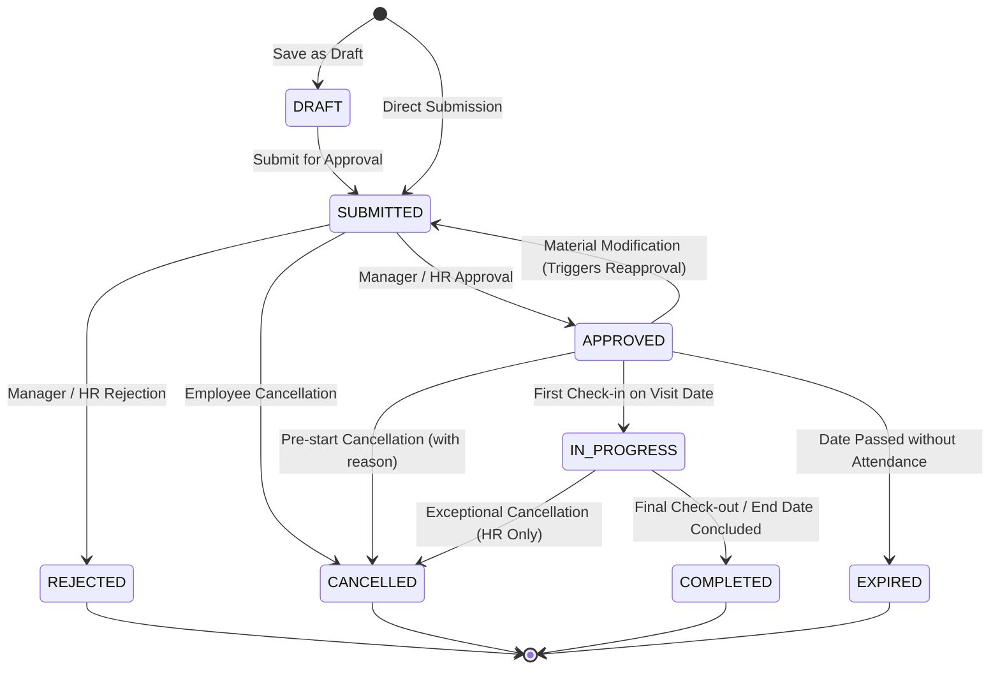
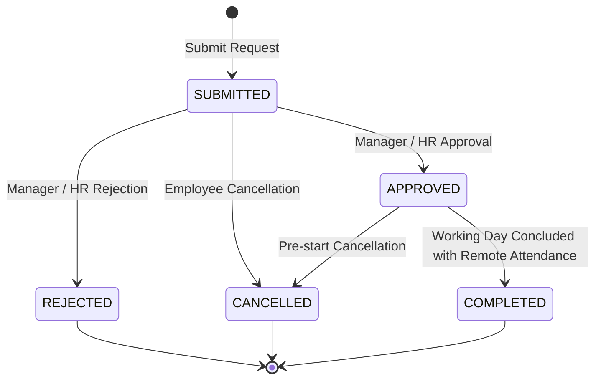
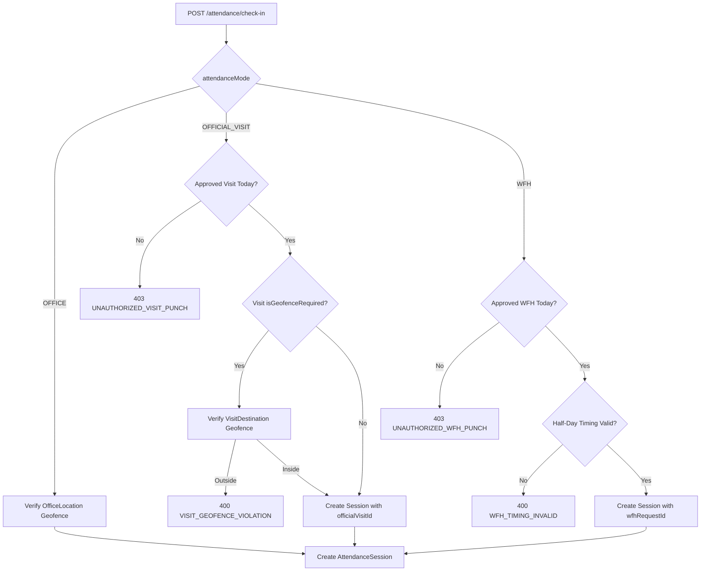

# Phase 5 Architecture & Implementation Plan: Official Visits & Work From Home (WFH)

## Executive Summary

Phase 5 extends the self-hosted PeopleOS HRMS core attendance platform with authorized field duty and remote work capabilities:

1. **Official Visits / Outdoor Duty (OD)**: Creation, manager approvals, destination geofencing, material change detection, and field check-in.
2. **Work From Home (WFH)**: Multi-duration remote work requests (full-day, half-day morning/afternoon, date ranges), manager maker-checker review, and privacy-preserving remote check-in.
3. **Unified Attendance Integration**: Leverages existing Phase 4 `AttendanceSession`, `AttendanceEvent`, and `AttendanceDailySummary` models and deterministic calculation pipelines without duplicating check-in engines or table schemas.

---

## 1. Current Reusable Services, Models & Dependencies

Before planning Phase 5, the active codebase was empirically inspected:

### 1.1 Verified Reusable Core Models (`packages/database/prisma/schema.prisma`)

- **`AttendanceSession`**: Continuous work interval tracking `OPEN`, `ON_BREAK`, `COMPLETED`, `AUTO_CLOSED`. Readily supports foreign keys `officialVisitId` and `wfhRequestId`.
- **`AttendanceEvent`**: Immutable append-only punch log storing UTC timestamps, coordinates, device metadata, and geofence results. Supports linking to visit/WFH authorization.
- **`AttendanceDailySummary`**: Single source of truth for daily work hours, break deductions, status (`PRESENT`, `HALF_DAY`, `ABSENT`), and attendance mode breakdown.
- **`AttendancePolicy` & `Shift`**: Provides deterministic shift timings, grace periods (15m), half-day thresholds (240m), full-day thresholds (420m), standard work hours (480m), and the 05:00 AM cutoff hour.
- **`OfficeLocation`**: Geofence coordinates and radius definitions for office attendance.
- **`Employee` & `User`**: Normalized employment records and user authentication profiles.

### 1.2 Verified Reusable Backend Services (`apps/api/src`)

- **`AttendanceService`**: Manages check-in, check-out, break start/end, missing checkout reconciliation, and daily summary computation.
- **`daily-attendance-calculator.util.ts` & `policy-evaluator.util.ts`**: Pure mathematical functions for deterministic attendance evaluation, timezone conversions, and shift window calculations.
- **`geofence.util.ts`**: Pure mathematical Haversine great-circle formula, coordinate bounds checking, and accuracy tolerance evaluation.
- **`HierarchyService`**: Common Table Expression (CTE) engine resolving direct and indirect subordinate trees for managers (`getDirectReportIds`, `getAllSubordinateIds`, `isSubordinateOf`).
- **`AccessControlService`**: Scopes queries by tenant organization, department, branch, and role permissions.
- **`AuditService`**: Sanitizes sensitive attributes and writes immutable records to PostgreSQL `audit_logs`.
- **`NotificationsService`**: In-app event notifications for employees and managers without paid external dependencies.

### 1.3 Baseline Dependency Status

- **Failing / Missing Dependencies**: **None**. All 19 test suites and 403 unit tests pass. All 42 live integration assertions pass. Monorepo linting, typechecks, and production builds are 100% clean.

---

## 2. Official Visit Workflow

### 2.1 Visit Request Attributes

Employees submit an official visit request containing:

- **Title**: Brief description (e.g. "Acme Corp Client Architecture Review").
- **Purpose**: Business justification and objectives.
- **Date Range**: `startDate` and `endDate` (UTC normalized).
- **Expected Duration**: Number of working days (e.g. 1.0, 2.5).
- **Destinations**: 1 to $N$ destination stops containing:
  - Destination name and address (city, state).
  - Target coordinates (`latitude`, `longitude`).
  - Allowed geofence radius (default: 200m).
  - `isGeofenceRequired`: Boolean flag (true for client offices with known GPS; false for roaming sales/inspections).

### 2.2 Official Visit State Machine



### 2.3 Material Change Reapproval Rule

- If an employee modifies a **non-material** field (e.g., minor notes), the approved status remains intact.
- If an employee modifies **material** parameters (dates, destinations, or coordinates) of an `APPROVED` visit, the status is immediately reset to `SUBMITTED`, invalidating existing approvals and requiring the manager to re-approve the changes.

---

## 3. Work From Home (WFH) Workflow

### 3.1 Request Types & Durations

Employees submit WFH requests specifying:

1. **`FULL_DAY`**: Employee is authorized to work remotely for the entire scheduled shift.
2. **`FIRST_HALF`**: Employee works remotely during the first half of the shift and is expected in the office for the second half.
3. **`SECOND_HALF`**: Employee works in the office for the first half and works remotely for the second half.
4. **`CUSTOM_RANGE`**: Multi-day consecutive remote work block (e.g., Monday through Wednesday).

### 3.2 WFH State Machine



### 3.3 Shift Window Alignment for Half-Day WFH

- When a `FIRST_HALF` WFH request is approved, the remote check-in must occur within the shift start window. An office punch later in the day will be recognized as the second half of the day.
- Net working time across both sessions is accumulated in `AttendanceDailySummary`.

---

## 4. Approval and Cancellation Rules

### 4.1 Strict Maker-Checker & Anti-Self-Approval

- **Rule**: No employee or manager may approve their own request under any circumstances.
- **Enforcement**:
  ```ts
  if (request.employee.userId === currentUser.id) {
    throw new ForbiddenException({
      statusCode: 403,
      message: 'Self-approval is strictly disallowed. You cannot approve your own request.',
      code: 'SELF_APPROVAL_DISALLOWED',
    });
  }
  ```
- **Manager Hierarchy Check**: The reviewer must either possess organizational `HR`/`ADMIN` role or be confirmed as an ancestor manager in the reporting chain via `hierarchyService.isSubordinateOf(request.employeeId, managerEmployeeId)`.

### 4.2 Overlap Policies

- **Visit Overlap**: An employee cannot submit or hold two approved `OfficialVisit` requests overlapping the same calendar date.
- **Visit vs WFH Overlap**: An employee cannot hold an approved `OfficialVisit` and an approved `WFH` on the exact same full-day working date.
- **Rejection**: Attempted submissions overlapping existing active requests fail with `409 Conflict` (`REQUEST_OVERLAP_CONFLICT`).

### 4.3 Cancellation Governance

- **Prior to Start Date**: Employee can freely cancel `SUBMITTED` or `APPROVED` requests.
- **After Date / During In-Progress**: Employee cannot cancel; cancellation requires an authorized HR Admin with documented audit notes.

---

## 5. Attendance Integration Design

### 5.1 Unified Check-In Engine (No Duplicate Logic)

The existing Phase 4 `POST /api/v1/attendance/check-in` is extended to support authorized field and remote punches:



### 5.2 Session & Daily Summary Representation

- `AttendanceSession`:
  - Stores `attendanceMode: AttendanceMode` (`OFFICE`, `OFFICIAL_VISIT`, `WFH`).
  - Stores `officialVisitId?: string` or `wfhRequestId?: string`.
- `AttendanceDailySummary`:
  - Tracks `primaryAttendanceMode: AttendanceMode`. If an employee has both office and field sessions in one day, the mode with greater working minutes is designated as primary.
  - Exposes `isOfficialVisit: boolean` and `isWfh: boolean`.

---

## 6. Location Verification Policy

### 6.1 Server-Side Validation Rules

1. **Coordinate Sanity**: Latitude $[-90.0, +90.0]$ and Longitude $[-180.0, +180.0]$.
2. **Timestamp Freshness**: Client GPS reading must be within $\le 300$ seconds (5 minutes) of authoritative server NTP time.
3. **Accuracy Tolerance**: GPS horizontal accuracy radius must be $\le 150$ meters. Readings with $> 150$m are rejected (`GPS_ACCURACY_POOR`).
4. **Distance Formula**: Pure spherical Haversine formula calculation:
   $$d = 2R \arcsin\left(\sqrt{\sin^2\left(\frac{\Delta\phi}{2}\right) + \cos\phi_1\cos\phi_2\sin^2\left(\frac{\Delta\lambda}{2}\right)}\right)$$
   Where $R = 6,371,000$ meters.
5. **Visit Geofence Bounds**: Distance between punch coordinates and authorized `VisitDestination` must be $\le \text{radiusMeters}$ (default 200m).

### 6.2 Privacy by Design for WFH

- **Home Privacy Rule**: For `WFH` mode, exact residential GPS coordinates are **not** collected or stored in the database by default. Punch events record `latitude: 0, longitude: 0, accuracyMeters: null` and log IP/device signatures only.

### 6.3 Honest Operational Disclaimers

- Browser `navigator.geolocation` can be mocked using browser developer tools or GPS spoofing mobile apps. Server-side checks reduce low-effort spoofing but cannot guarantee physical truth.
- Physical location presence is never legally equivalent to proof of actual work performance.

---

## 7. Database Migration Plan

### 7.1 Schema Additions in `packages/database/prisma/schema.prisma`

```prisma
enum VisitStatus {
  DRAFT
  SUBMITTED
  APPROVED
  REJECTED
  CANCELLED
  IN_PROGRESS
  COMPLETED
  EXPIRED
}

enum WfhStatus {
  SUBMITTED
  APPROVED
  REJECTED
  CANCELLED
  COMPLETED
}

enum WfhDurationType {
  FULL_DAY
  FIRST_HALF
  SECOND_HALF
  CUSTOM_RANGE
}

enum ApprovalDecision {
  APPROVED
  REJECTED
}

enum AttendanceMode {
  OFFICE
  OFFICIAL_VISIT
  WFH
}

model OfficialVisit {
  id                   String             @id @default(uuid())
  organizationId       String
  organization         Organization       @relation(fields: [organizationId], references: [id], onDelete: Cascade)
  employeeId           String
  employee             Employee           @relation(fields: [employeeId], references: [id], onDelete: Cascade)

  title                String
  purpose              String
  startDate            DateTime           // Normalized UTC midnight
  endDate              DateTime           // Normalized UTC midnight
  expectedDurationDays Float              @default(1.0)
  status               VisitStatus        @default(SUBMITTED)
  cancellationReason   String?

  destinations         VisitDestination[]
  approvals            VisitApproval[]
  attendanceSessions   AttendanceSession[]
  attendanceDailySummaries AttendanceDailySummary[]

  createdAt            DateTime           @default(now())
  updatedAt            DateTime           @updatedAt

  @@index([organizationId, status])
  @@index([employeeId, startDate, endDate])
  @@index([status])
  @@map("official_visits")
}

model VisitDestination {
  id                   String             @id @default(uuid())
  visitId              String
  visit                OfficialVisit      @relation(fields: [visitId], references: [id], onDelete: Cascade)

  destinationName      String
  address              String?
  city                 String?
  latitude             Float?
  longitude            Float?
  radiusMeters         Int                @default(200)
  isGeofenceRequired   Boolean            @default(true)

  createdAt            DateTime           @default(now())
  updatedAt            DateTime           @updatedAt

  @@index([visitId])
  @@map("visit_destinations")
}

model VisitApproval {
  id                   String             @id @default(uuid())
  visitId              String
  visit                OfficialVisit      @relation(fields: [visitId], references: [id], onDelete: Cascade)

  approverId           String
  approver             User               @relation(fields: [approverId], references: [id], onDelete: Restrict)

  decision             ApprovalDecision
  comments             String?
  decidedAt            DateTime           @default(now())

  @@index([visitId])
  @@index([approverId])
  @@map("visit_approvals")
}

model WfhRequest {
  id                   String             @id @default(uuid())
  organizationId       String
  organization         Organization       @relation(fields: [organizationId], references: [id], onDelete: Cascade)
  employeeId           String
  employee             Employee           @relation(fields: [employeeId], references: [id], onDelete: Cascade)

  startDate            DateTime           // Normalized UTC midnight
  endDate              DateTime           // Normalized UTC midnight
  durationType         WfhDurationType    @default(FULL_DAY)
  reason               String
  status               WfhStatus          @default(SUBMITTED)
  cancellationReason   String?

  approvals            WfhApproval[]
  attendanceSessions   AttendanceSession[]
  attendanceDailySummaries AttendanceDailySummary[]

  createdAt            DateTime           @default(now())
  updatedAt            DateTime           @updatedAt

  @@index([organizationId, status])
  @@index([employeeId, startDate, endDate])
  @@index([status])
  @@map("wfh_requests")
}

model WfhApproval {
  id                   String             @id @default(uuid())
  requestId            String
  request              WfhRequest         @relation(fields: [requestId], references: [id], onDelete: Cascade)

  approverId           String
  approver             User               @relation(fields: [approverId], references: [id], onDelete: Restrict)

  decision             ApprovalDecision
  comments             String?
  decidedAt            DateTime           @default(now())

  @@index([requestId])
  @@index([approverId])
  @@map("wfh_approvals")
}
```

### 7.2 Non-Destructive Schema Alterations

- Add `attendanceMode AttendanceMode @default(OFFICE)` to `AttendanceSession` and `AttendanceEvent`.
- Add `officialVisitId String?` and `wfhRequestId String?` (nullable foreign keys) to `AttendanceSession`, `AttendanceEvent`, and `AttendanceDailySummary`.
- Add `primaryAttendanceMode AttendanceMode @default(OFFICE)` to `AttendanceDailySummary`.

---

## 8. API Contract Plan

All routes conform to `/api/v1` conventions:

### 8.1 Official Visits API (`/api/v1/visits`)

| Route                         | Method  |          Roles           |   Permission    | Description                                                  |
| :---------------------------- | :-----: | :----------------------: | :-------------: | :----------------------------------------------------------- |
| `/visits`                     | `POST`  |           All            | `VISIT_CREATE`  | Create a new official visit (as `DRAFT` or `SUBMITTED`)      |
| `/visits/my`                  |  `GET`  |           All            |  `VISIT_VIEW`   | Paginated visit requests submitted by current employee       |
| `/visits/:id`                 |  `GET`  |           All            |  `VISIT_VIEW`   | Detailed visit view (destinations, approval trail)           |
| `/visits/:id`                 | `PATCH` |           All            | `VISIT_CREATE`  | Update visit. Modifying approved visit resets to `SUBMITTED` |
| `/visits/:id/cancel`          | `POST`  |           All            | `VISIT_CREATE`  | Cancel visit before start date with reason                   |
| `/visits/manager/pending`     |  `GET`  | `MANAGER`, `HR`, `ADMIN` | `VISIT_APPROVE` | Scoped list of pending visit requests from reporting team    |
| `/visits/:id/decide`          | `POST`  | `MANAGER`, `HR`, `ADMIN` | `VISIT_APPROVE` | Approve or reject a subordinate's visit request              |
| `/visits/operations/overview` |  `GET`  |      `HR`, `ADMIN`       |  `VISIT_VIEW`   | Organization-wide active and upcoming field visits monitor   |

### 8.2 Work From Home API (`/api/v1/wfh`)

| Route                      | Method |          Roles           |  Permission   | Description                                                         |
| :------------------------- | :----: | :----------------------: | :-----------: | :------------------------------------------------------------------ |
| `/wfh`                     | `POST` |           All            | `WFH_CREATE`  | Submit WFH request (`FULL_DAY`, `FIRST_HALF`, `SECOND_HALF`, range) |
| `/wfh/my`                  | `GET`  |           All            |  `WFH_VIEW`   | Paginated WFH requests submitted by current employee                |
| `/wfh/:id`                 | `GET`  |           All            |  `WFH_VIEW`   | Detailed WFH request view and decision history                      |
| `/wfh/:id/cancel`          | `POST` |           All            | `WFH_CREATE`  | Cancel a pending or upcoming WFH request                            |
| `/wfh/manager/pending`     | `GET`  | `MANAGER`, `HR`, `ADMIN` | `WFH_APPROVE` | Scoped pending WFH requests from manager's reporting team           |
| `/wfh/:id/decide`          | `POST` | `MANAGER`, `HR`, `ADMIN` | `WFH_APPROVE` | Approve or reject subordinate's WFH request                         |
| `/wfh/operations/overview` | `GET`  |      `HR`, `ADMIN`       |  `WFH_VIEW`   | Organization-wide remote attendance overview                        |

### 8.3 Enhanced Check-In Payload

```json
{
  "latitude": 19.076,
  "longitude": 72.8777,
  "accuracyMeters": 20,
  "idempotencyKey": "9b1deb4d-3b7d-4bad-9bdd-2b0d7b3dcb6d",
  "attendanceMode": "OFFICIAL_VISIT",
  "officialVisitId": "vis-8f19da2e-4b61-419b-a01b-9471de81b0a1",
  "deviceInfo": "Chrome 124 / Android"
}
```

---

## 9. Role & Scope Matrix

| Action / Resource                |          Employee          |                 Manager                 |            HR            |          Admin           |
| :------------------------------- | :------------------------: | :-------------------------------------: | :----------------------: | :----------------------: |
| **Create Visit / WFH**           |     Own requests only      |            Own requests only            |    Own requests only     |    Own requests only     |
| **View Requests**                | Self (`employeeId = self`) | Team Subtree (`isSubordinateOf`) + Self |    Organization-wide     |    Organization-wide     |
| **Edit Draft Request**           |  Self (before submission)  |        Self (before submission)         | Self (before submission) | Self (before submission) |
| **Cancel Request**               |    Self (before start)     |           Self (before start)           |  Any (with audit note)   |  Any (with audit note)   |
| **Approve / Reject**             |         **DENIED**         | Team Subtree only (Anti-self-approval)  |    Organization-wide     |    Organization-wide     |
| **Punch Attendance**             |   Self (under approval)    |          Self (under approval)          |  Self (under approval)   |  Self (under approval)   |
| **Override / Emergency Excusal** |         **DENIED**         |               **DENIED**                |    Organization-wide     |    Organization-wide     |
| **View GPS Evidence**            |            Self            |    Team (City/Perimeter status only)    |    Full raw audit log    |    Full raw audit log    |

---

## 10. Security Threats & Mitigations

| Threat Vector                  |   Severity   | Attack Description                                    | Architectural Mitigation                                                                                                |
| :----------------------------- | :----------: | :---------------------------------------------------- | :---------------------------------------------------------------------------------------------------------------------- |
| **Self-Approval Bypass**       | **CRITICAL** | Manager submits WFH/Visit and approves own request    | Cryptographic check `request.employee.userId !== reviewer.id` returns 403 `SELF_APPROVAL_DISALLOWED`.                   |
| **Cross-Tenant IDOR**          | **CRITICAL** | Tenant A attempts to approve or view Tenant B visits  | Prisma queries filter strictly by `organizationId: user.organizationId`.                                                |
| **Cross-Team Manager IDOR**    |   **HIGH**   | Manager approves peer or foreign department request   | `hierarchyService.isSubordinateOf` verifies ancestry. Foreign requests return 403 `FORBIDDEN_OUTSIDE_SCOPE`.            |
| **Overlapping Double-Booking** |   **HIGH**   | Multiple visits/WFH submitted for identical dates     | Database transactions and collision checks return 409 `REQUEST_OVERLAP_CONFLICT`.                                       |
| **Stale GPS Injection**        |  **MEDIUM**  | Attacker replays previously captured office/visit GPS | Server verifies GPS reading age $\le 300$s; rejects stale timestamps.                                                   |
| **Out-of-Radius Punch**        |  **MEDIUM**  | Employee punches field attendance from home/hotel     | Server calculates Haversine distance; punches $> \text{radiusMeters}$ are rejected with 400 `VISIT_GEOFENCE_VIOLATION`. |
| **Residential GPS Leak**       |  **MEDIUM**  | WFH captures precise employee home coordinates        | WFH mode zeros coordinates (`0.0, 0.0`) by design; no home GPS captured.                                                |

---

## 11. Automated Test Strategy

The test plan covers unit, integration, and E2E security layers:

1. **Unit Test Suites (`apps/api/src/modules/visits/*.spec.ts`, `wfh/*.spec.ts`)**:
   - State transition validation (valid vs invalid transitions).
   - Date range parsing and working day overlap detection.
   - Half-day WFH shift boundary calculations.
   - Material change detection and reapproval triggers.
2. **Security & RBAC Test Suite (`apps/api/test/visit-wfh-security.spec.ts`)**:
   - Anti-self-approval enforcement for managers and admins.
   - Cross-tenant IDOR attack attempts.
   - Manager team boundary traversal attacks.
   - GPS coordinate boundary and freshness rejection.
   - Unapproved mode check-in rejection (`UNAUTHORIZED_VISIT_PUNCH`, `UNAUTHORIZED_WFH_PUNCH`).
3. **Live E2E Integration Suite**:
   - Create visit request → Manager approve → Punch field check-in with GPS → Complete session.
   - Create WFH request → Manager approve → Remote punch (zero GPS captured) → Accumulate daily summary.
   - Backward-compatibility verification: Office check-in continues to pass 100% unchanged.

---

## 12. Unresolved Decisions for HR Leadership

Prior to production launch, HR leadership must provide policy sign-off on:

1. **Maximum Consecutive WFH Allowance**:
   - _Question_: Should the system enforce a cap on consecutive WFH days (e.g., maximum 3 days/week or 10 days/month), or leave it unmetered subject to manager approval?
2. **Prior Notice Lead Time**:
   - _Question_: Must Official Visits and WFH requests be submitted at least $N$ days in advance (e.g., 24 hours prior), or are retroactive same-day requests permitted for emergencies?
3. **Roaming Visits Geofence Exemption**:
   - _Question_: For sales or field inspection visits where exact coordinates are unknown in advance, should HR allow `isGeofenceRequired = false` (roaming outdoor duty), or require specifying at least one landmark/city center?
4. **Half-Day Shift Transition Window**:
   - _Question_: When an employee takes `FIRST_HALF` WFH, what is the allowable transit window between their morning remote checkout and their afternoon office check-in?
