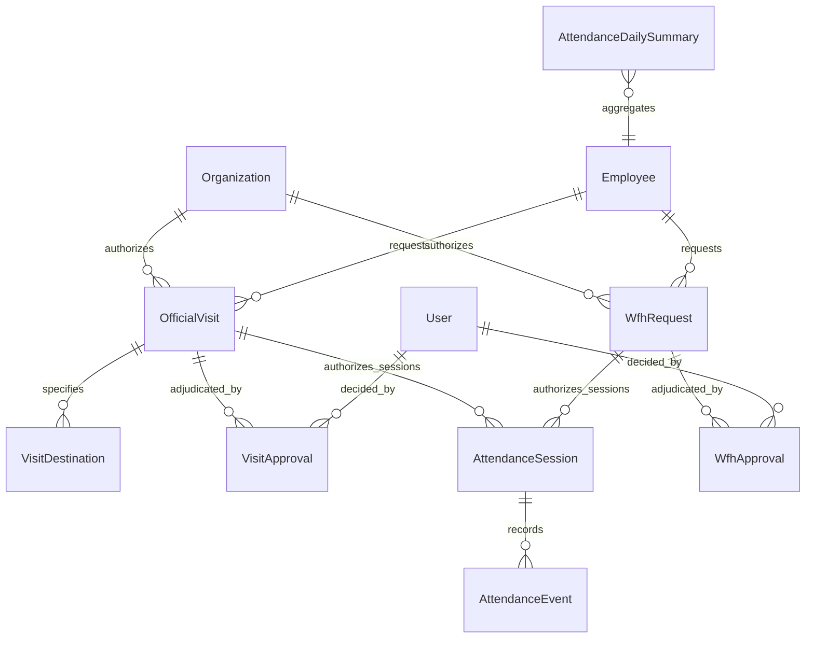

# Phase 5 Implementation Plan: Official Visits & Work From Home (WFH)

## Executive Summary

Phase 5 extends the production-grade PeopleOS Attendance Engine (Phase 4) with authorized field duty and remote work workflows:

1. **Official Visits / Outdoor Duty (OD)**: Request, approval, field destination geofencing, and GPS-verified outdoor attendance.
2. **Work From Home (WFH)**: Full-day, half-day (first/second half), and multi-day remote work requests with manager maker-checker approvals and privacy-minimized remote check-in.
3. **Unified Attendance Integration**: Seamlessly connects with Phase 4 `AttendanceSession`, `AttendanceEvent`, and `AttendanceDailySummary` models and deterministic calculation pipelines without duplicating check-in engines or table schemas.

---

## 1. Current State Verification (Phase 4 Baseline)

Before planning, the active repository was verified against all existing Phase 4 capabilities:

- **Prisma Migrations**: 10 incremental migrations applied cleanly (`pnpm --filter @hrms/database exec prisma migrate status` reports schema is up to date).
- **Backend Test Suite**: **19 test suites passed, 403/403 unit tests passed** (`npm --prefix apps/api test`).
- **Live E2E Integration Suite**: **42/42 assertions passed** (`scratch/test_step15_e2e_verification.js`) against live PostgreSQL and NestJS API.
- **Monorepo Lint & Typecheck**: **5/5 lint tasks clean, 9/9 package typechecks clean**.
- **Production Build**: Both NestJS API (`apps/api/dist`) and Next.js 14 Web App (`apps/web/.next`) compile with zero errors (`turbo run build` in 24.8s).
- **Existing `attendanceMode` Handling**: In Phase 4, `attendance.service.ts` intentionally rejected non-`OFFICE` punches (`UNAPPROVED_ATTENDANCE_MODE`). Phase 5 will officially activate `OFFICIAL_VISIT` and `WFH` modes under verified authorization.

---

## 2. Domain Models & Database Schema Design

Phase 5 introduces targeted, normalized database entities in `packages/database/prisma/schema.prisma` while linking directly to existing models (`Organization`, `Employee`, `User`, `AttendanceSession`, `AttendanceDailySummary`):



### 2.1 Enums

```prisma
enum VisitStatus {
  DRAFT
  SUBMITTED
  APPROVED
  REJECTED
  CANCELLED
  IN_PROGRESS
  COMPLETED
  EXPIRED
}

enum WfhStatus {
  SUBMITTED
  APPROVED
  REJECTED
  CANCELLED
  COMPLETED
}

enum WfhDurationType {
  FULL_DAY
  FIRST_HALF
  SECOND_HALF
  CUSTOM_RANGE
}

enum ApprovalDecision {
  APPROVED
  REJECTED
}
```

### 2.2 Models

#### `OfficialVisit` (`official_visits`)

```prisma
model OfficialVisit {
  id                  String             @id @default(uuid())
  organizationId      String
  organization        Organization       @relation(fields: [organizationId], references: [id], onDelete: Cascade)
  employeeId          String
  employee            Employee           @relation(fields: [employeeId], references: [id], onDelete: Cascade)

  title               String             // e.g. "Onsite Architecture Review"
  purpose             String             // Detailed business justification
  startDate           DateTime           // UTC date
  endDate             DateTime           // UTC date
  expectedDurationDays Float             @default(1.0)

  status              VisitStatus        @default(SUBMITTED)
  cancellationReason  String?

  // Destination details
  destinations        VisitDestination[]

  // Approvals & audit
  approvals           VisitApproval[]
  attendanceSessions  AttendanceSession[]

  createdAt           DateTime           @default(now())
  updatedAt           DateTime           @updatedAt

  @@index([organizationId, status])
  @@index([employeeId, startDate, endDate])
  @@index([status])
  @@map("official_visits")
}
```

#### `VisitDestination` (`visit_destinations`)

```prisma
model VisitDestination {
  id                  String             @id @default(uuid())
  visitId             String
  visit               OfficialVisit      @relation(fields: [visitId], references: [id], onDelete: Cascade)

  destinationName     String             // e.g. "Acme Tech Labs HQ"
  address             String?
  city                String?
  latitude            Float?             // Optional geofence target
  longitude           Float?             // Optional geofence target
  radiusMeters        Int                @default(200) // Verification tolerance
  isGeofenceRequired  Boolean            @default(true)

  createdAt           DateTime           @default(now())
  updatedAt           DateTime           @updatedAt

  @@index([visitId])
  @@map("visit_destinations")
}
```

#### `VisitApproval` (`visit_approvals`)

```prisma
model VisitApproval {
  id                  String             @id @default(uuid())
  visitId             String
  visit               OfficialVisit      @relation(fields: [visitId], references: [id], onDelete: Cascade)

  approverId          String
  approver            User               @relation(fields: [approverId], references: [id], onDelete: Restrict)

  decision            ApprovalDecision   // APPROVED / REJECTED
  comments            String?
  decidedAt           DateTime           @default(now())

  @@index([visitId])
  @@index([approverId])
  @@map("visit_approvals")
}
```

#### `WfhRequest` (`wfh_requests`)

```prisma
model WfhRequest {
  id                  String             @id @default(uuid())
  organizationId      String
  organization        Organization       @relation(fields: [organizationId], references: [id], onDelete: Cascade)
  employeeId          String
  employee            Employee           @relation(fields: [employeeId], references: [id], onDelete: Cascade)

  startDate           DateTime           // UTC date
  endDate             DateTime           // UTC date
  durationType        WfhDurationType    @default(FULL_DAY) // FULL_DAY, FIRST_HALF, SECOND_HALF, CUSTOM_RANGE
  reason              String             // Justification

  status              WfhStatus          @default(SUBMITTED)
  cancellationReason  String?

  approvals           WfhApproval[]
  attendanceSessions  AttendanceSession[]

  createdAt           DateTime           @default(now())
  updatedAt           DateTime           @updatedAt

  @@index([organizationId, status])
  @@index([employeeId, startDate, endDate])
  @@index([status])
  @@map("wfh_requests")
}
```

#### `WfhApproval` (`wfh_approvals`)

```prisma
model WfhApproval {
  id                  String             @id @default(uuid())
  requestId           String
  request             WfhRequest         @relation(fields: [requestId], references: [id], onDelete: Cascade)

  approverId          String
  approver            User               @relation(fields: [approverId], references: [id], onDelete: Restrict)

  decision            ApprovalDecision   // APPROVED / REJECTED
  comments            String?
  decidedAt           DateTime           @default(now())

  @@index([requestId])
  @@index([approverId])
  @@map("wfh_approvals")
}
```

#### Updates to Existing Models:

- `AttendanceSession`:
  - `officialVisitId String?` (FK to `OfficialVisit`)
  - `wfhRequestId String?` (FK to `WfhRequest`)
  - `attendanceMode AttendanceMode @default(OFFICE)` (Enum: `OFFICE`, `OFFICIAL_VISIT`, `WFH`)
- `AttendanceEvent`:
  - `officialVisitId String?`
  - `wfhRequestId String?`
- `AttendanceDailySummary`:
  - `primaryAttendanceMode AttendanceMode @default(OFFICE)`
  - `officialVisitId String?`
  - `wfhRequestId String?`

---

## 3. Attendance Engine Integration & Rules

### 3.1 Strict Authorization Verification

When an employee punches with `attendanceMode`:

1. **`OFFICE`**: Verified against assigned active `OfficeLocation` perimeter (Phase 4).
2. **`OFFICIAL_VISIT`**:
   - Checks if employee has an active `OfficialVisit` in status `APPROVED` or `IN_PROGRESS` covering the working date.
   - Verifies if destination geofence is required:
     - If `isGeofenceRequired = true`, checks server-side distance to authorized visit destination (`latitude`, `longitude`, `radiusMeters`).
     - Rejects out-of-radius punches with `VISIT_GEOFENCE_VIOLATION`.
   - Checks GPS freshness ($\le 5$ min) and accuracy ($\le 150$m).
   - Links session directly to `officialVisit.id`.
3. **`WFH`**:
   - Checks if employee has an active `WfhRequest` in status `APPROVED` covering the working date.
   - For half-day WFH (`FIRST_HALF` or `SECOND_HALF`), validates punch timestamp against scheduled half-day shift boundaries.
   - **Privacy Rule**: Does NOT require or capture home coordinates by default unless explicit high-security policy mandates.
   - Links session directly to `wfhRequest.id`.

### 3.2 Overlap Prevention & State Invariants

- An employee cannot have overlapping approved visits on the same date.
- An employee cannot have overlapping approved WFH and Visit requests on the same date.
- An active `AttendanceSession` cannot be opened if another session is already `OPEN`.
- Approval does not equal attendance; employees must still check in/out to establish working hours.

### 3.3 Strict Anti-Self-Approval Guard

- Managers and Team Leads are cryptographically prevented from approving their own visit or WFH requests:
  `if (request.employee.userId === currentUser.id) throw new ForbiddenException('SELF_APPROVAL_DISALLOWED')`.
- Manager approvals are scoped strictly to direct and indirect reporting subordinates resolved via `hierarchy.service.ts`.

---

## 4. API Endpoints Architecture

All endpoints follow RESTful conventions under `/api/v1`:

### 4.1 Official Visits API (`/api/v1/visits`)

- `POST /visits`: Create an official visit request (draft or submit).
- `GET /visits/my`: Get current employee's visit history with pagination and status filters.
- `GET /visits/:id`: Get full details of a specific visit, destinations, and approval timeline.
- `PATCH /visits/:id`: Update draft or modify pending visit. (Modifying an approved visit resets status to `SUBMITTED` for reapproval).
- `POST /visits/:id/cancel`: Cancel visit before or during execution.
- `GET /visits/manager/pending`: List pending visit requests for the manager's reporting team.
- `POST /visits/:id/decide`: Manager approve/reject with review comments.
- `GET /visits/operations/overview`: HR/Admin organization-wide visit monitor with filters.

### 4.2 Work From Home API (`/api/v1/wfh`)

- `POST /wfh`: Submit a WFH request (full-day, half-day, date range).
- `GET /wfh/my`: Get current employee's WFH requests.
- `GET /wfh/:id`: Get WFH request detail and decision history.
- `POST /wfh/:id/cancel`: Cancel a pending or upcoming WFH request.
- `GET /wfh/manager/pending`: List pending WFH requests for manager's reporting team.
- `POST /wfh/:id/decide`: Manager approve/reject with review comments.
- `GET /wfh/operations/overview`: HR/Admin organization-wide remote work overview.

### 4.3 Enhanced Attendance Punch APIs

- `POST /attendance/check-in`: Enhanced to validate `attendanceMode` (`OFFICE`, `OFFICIAL_VISIT`, `WFH`) with `officialVisitId` or `wfhRequestId`.
- `GET /attendance/today`: Returns authorized attendance modes for today based on active approvals.

---

## 5. User Interface & Design System Integration

Preserves the established **warm ivory, amber/gold, deep charcoal** design system:

### 5.1 Employee Experience

1. **Visits Portal (`/visits`)**:
   - Modern tabbed layout: "My Visits", "New Request".
   - Destination builder with city, coordinates/radius, and expected duration.
   - Status cards with visual timeline (`SUBMITTED` → `APPROVED` → `IN_PROGRESS` → `COMPLETED`).
2. **WFH Request Modal & Portal**:
   - Clean radio selector for `Full Day`, `First Half (Morning)`, `Second Half (Afternoon)`, `Date Range`.
   - Date picker with conflict detection and remaining balance indicator.
3. **Smart Punch Card (`/attendance`)**:
   - Dynamically highlights available attendance modes:
     - Office (Always available if in office perimeter)
     - Official Visit (Active badge if visit approved for today)
     - WFH (Active badge if WFH approved for today)
   - Disables unauthorized modes with explanatory tooltips.

### 5.2 Manager Experience

1. **Approvals Hub (`/team` or `/approvals`)**:
   - Dedicated "Field Visits" and "WFH Requests" review tabs.
   - Team calendar showing who is in office, on visit, or WFH today.
   - Quick one-click Approve / Reject with mandatory comment modal.

### 5.3 HR Operations Interface

1. **Organization Field & Remote Attendance Monitor**:
   - Headcount KPI cards: Onsite %, WFH %, Official Visit %, Unresolved OD Anomalies.
   - Paginated operations table with branch, department, and destination filters.
   - Audit trail drawer inspecting raw GPS events and approval histories.

---

## 6. Step-by-Step Implementation Roadmap

```mermaid
gantt
    title Phase 5 Implementation Steps
    dateFormat  X
    axisFormat Step %s
    section Database & Core
    Step 1 Database Schema & Migrations       :active, 1, 2
    Step 2 Visits Backend Service             :2, 3
    Step 3 WFH Backend Service                :3, 4
    Step 4 Attendance Engine Integration      :4, 5
    section APIs & Scoping
    Step 5 Visits & WFH REST Endpoints        :5, 6
    Step 6 Manager Approval & Scoping APIs    :6, 7
    Step 7 HR Operations & Exceptions         :7, 8
    Step 8 Unit & Security Test Suites        :8, 9
    section Frontend & UI
    Step 9 Web API Contracts & Hooks          :9, 10
    Step 10 Employee Visits UI                :10, 11
    Step 11 Employee WFH UI                   :11, 12
    Step 12 Smart Attendance Punch Card UI    :12, 13
    Step 13 Manager Approvals Portal          :13, 14
    Step 14 HR Operations & Audit Monitor     :14, 15
    section QA & Acceptance
    Step 15 End-to-End QA & Responsive Polish :15, 16
    Step 16 Production Readiness & Acceptance :16, 17
```



### Detailed Steps:

- **Step 1: Database Foundation & Prisma Migrations**: Define `OfficialVisit`, `VisitDestination`, `VisitApproval`, `WfhRequest`, `WfhApproval` in `schema.prisma`. Run non-destructive migration.
- **Step 2: Official Visits Core Service**: Implement state machine, overlap checks, destination validation, and material change detection.
- **Step 3: Work From Home Core Service**: Implement WFH request lifecycle, duration parsing (half-day vs full-day), and overlap rules.
- **Step 4: Attendance Engine Integration**: Update `attendance.service.ts` to allow and enforce `OFFICIAL_VISIT` and `WFH` check-ins, linking sessions to authorized requests.
- **Step 5: Visits & WFH REST APIs**: Create NestJS controllers, DTOs with `class-validator`, Swagger annotations, and standardized error responses.
- **Step 6: Manager Approval APIs & Scoping**: Implement manager team queue, hierarchy scoping, review notes, and anti-self-approval enforcement.
- **Step 7: HR Operations, Exception Management & Reporting**: Extend attendance reports and exception scanner to surface visit and WFH anomalies.
- **Step 8: Backend Unit & Security Tests**: Comprehensive test suite covering state transitions, GPS tolerance, cross-tenant isolation, overlap rejection, and anti-self-approval.
- **Step 9: Web Client API & Typed Contracts**: Add typed API clients in `apps/web/src/lib/api-client.ts` and React hooks.
- **Step 10: Employee Official Visits UI**: Build `/visits` page with request creation dialog, status cards, and destination details.
- **Step 11: Employee WFH Requests UI**: Implement WFH request dialog with duration pickers, conflict warnings, and history table.
- **Step 12: Smart Attendance Punch Card UI**: Upgrade `/attendance` quick check-in card to adapt dynamically to today's approved mode (Office, OD, WFH).
- **Step 13: Manager Approvals Portal**: Build manager team review queue with decision drawer and team calendar preview.
- **Step 14: HR Operations Dashboard & Audit Monitor**: Add organization-wide OD and remote work filters, charts, and export options.
- **Step 15: End-to-End QA & UI Polish**: Verify desktop, tablet, and mobile layouts; test GPS spoof edge cases, clock drift, and offline behaviors.
- **Step 16: Production Readiness & Acceptance Matrix**: Verify Docker builds, migration locks, health probes, rollback runbooks, and produce final acceptance matrix.

---

## 7. Testing & Acceptance Criteria

| Category                 | Test Scenario                                                   | Acceptance Criteria                                        |
| :----------------------- | :-------------------------------------------------------------- | :--------------------------------------------------------- |
| **Visit State Machine**  | Invalid status transition (e.g. `REJECTED` → `APPROVED`)        | Rejected with 400 `INVALID_STATE_TRANSITION`               |
| **Overlapping Requests** | Overlapping visit or WFH on identical dates                     | Rejected with 409 `REQUEST_OVERLAP_CONFLICT`               |
| **Anti-Self-Approval**   | Manager attempts to approve their own visit or WFH              | Blocked with 403 `SELF_APPROVAL_DISALLOWED`                |
| **Cross-Tenant IDOR**    | User queries visit ID belonging to another organization         | Rejected with 404 / 403 access control                     |
| **Visit Geofence**       | Punch with `OFFICIAL_VISIT` mode 500m outside visit destination | Rejected with 400 `VISIT_GEOFENCE_VIOLATION`               |
| **Unapproved WFH**       | Punch with `WFH` mode without approved WFH request              | Rejected with 403 `UNAUTHORIZED_WFH_PUNCH`                 |
| **Half-Day WFH**         | `FIRST_HALF` WFH punched in during evening window               | Evaluated against second-half shift rules or flagged       |
| **Privacy Preservation** | WFH punch event stored in database                              | Zero coordinates collected unless explicit policy mandates |
| **Office Continuity**    | Standard office check-in / check-out                            | 100% backward-compatible, unchanged Phase 4 behavior       |
